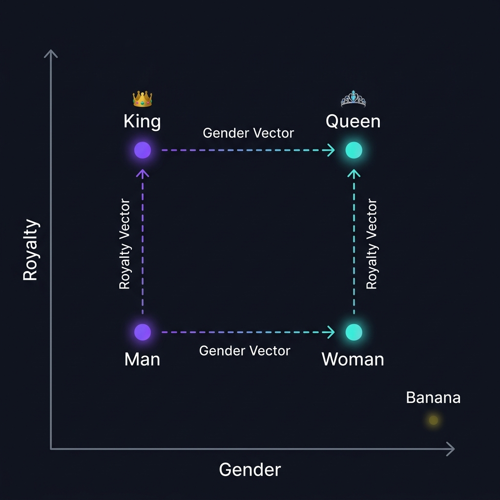

# THE MAKING OF AN LLM {.act-section .act-pre background-color="#0D0F1A"}

::: badge-v
The Construction Pipeline
:::

## Group 1: Pre-training — 1. Tokenization & Vocab {auto-animate="true"}

<div style="height: 2.5rem;"></div>

::: {.columns}

::: {.column width="50%"}
### The Technical Concept
A raw string of text must be converted into numerical inputs.
- **Tokens**: The atomic subword units produced by algorithms like **BPE (Byte-Pair Encoding)**.
- **Vocabulary $\mathcal{V}$**: The static collection of all unique tokens (typically $|\mathcal{V}| \approx 32k - 256k$).

::: formula-box
$$\text{Tokenizer}(S) = [t_1, t_2, \ldots, t_N] \quad \text{where } t_i \in \mathcal{V}$$
:::
:::

::: {.column width="50%"}
### The Intuitive Analogy
> Think of this as cutting a massive text into standard-sized Lego bricks. If you have a brick for every single word, your box is too huge. If you only have letters, it takes too long to build. Tokens are the optimal medium-sized bricks, where each brick gets a unique **integer ID** (like a barcode).

::: card-v
**Example Mapping:**
`"Understanding LLMs is fantastic!"`
$\downarrow$
`["Under", "standing", " LL", "Ms", " is", " fantastic", "!"]`
$\downarrow$
`[12405, 4321, 298, 1543, 310, 8912, 102]`
:::
:::

:::

## Group 1: Pre-training — Visual Schema: Tokenization Flow {auto-animate="true"}

<div style="height: 2.5rem;"></div>

::: {.arch-flow}

::: {.arch-node}
<h4>📝 1. Raw Text String</h4>
`"Understanding LLMs..."`
:::

::: {.arch-arrow}
➔
:::

::: {.arch-node .core}
<h4>✂️ 2. BPE Tokenizer</h4>
`["Under", "standing", " LL", "Ms"]`
:::

::: {.arch-arrow}
➔
:::

::: {.arch-node}
<h4>🔢 3. Numerical Token IDs</h4>
`[12405, 4321, 298, 1543]`
:::

:::

<div style="height: 2.5rem;"></div>

::: highlight-band
**Pedagogical Insight**: The model does not see text as human letters. It sees a sequence of unique mathematical integer codes that act as keys into its vocabulary database.
:::

## Group 1: Pre-training — 2. Embeddings & Space {auto-animate="true"}

<div style="height: 2.5rem;"></div>

::: {.columns}

::: {.column width="50%"}
### The Technical Concept
Words must represent meaning mathematically. We map each token ID to a dense continuous vector in a high-dimensional space:

::: formula-box
$$\vec{e}_i = \mathbf{E}[t_i] \in \mathbb{R}^{d_{\text{model}}} \quad \text{where } d_{\text{model}} \approx 4096$$
:::

We measure semantic similarity using **Cosine Similarity**:
$$\cos(\theta) = \frac{\vec{A} \cdot \vec{B}}{\|\vec{A}\| \|\vec{B}\|}$$
:::

::: {.column width="50%"}
### The Intuitive Analogy
> How do you explain "royalty" or "gender" to a computer? You place them on a giant multi-dimensional map.
> On this map, words with similar meanings are physical neighbors.

::: card-v
**Vector Math in Action:**
$$\vec{v}_{\text{King}} - \vec{v}_{\text{Man}} \approx \vec{v}_{\text{Queen}} - \vec{v}_{\text{Woman}}$$

Moving in a specific direction (adding a "gender vector") transforms the coordinates of **King** into **Queen**.
:::
:::

:::

## Group 1: Pre-training — Visual Schema: The Vector Map {auto-animate="true"}

<div style="height: 2rem;"></div>

::: {.columns}

::: {.column width="58%"}
<div style="background: rgba(255,255,255,0.02); border: 1px solid rgba(255,255,255,0.08); border-radius: 14px; padding: 1rem; text-align: center;">
<p style="font-family: 'Outfit', sans-serif; font-size: 1.1rem; font-weight: 600; color: #A5B4FC; margin-bottom: 0.8rem; letter-spacing: 0.03em;">Multi-Dimensional Coordinate Space — $\mathbb{R}^{d_{\text{model}}}$</p>

{width="100%"}

</div>
:::

::: {.column width="42%"}
<div style="height: 0.5rem;"></div>

::: card-v
**The Geometry of Meaning**

Words are placed on a map with $d_{\text{model}}$ dimensions. Their **position** encodes their **meaning**.
:::

<div style="height: 0.6rem;"></div>

::: highlight-band
**Vector parallelism** — The offset from *Man* → *Woman* is geometrically parallel to *King* → *Queen*. This is the arithmetic of meaning.
:::

<div style="height: 0.6rem;"></div>

::: card-g
**Semantic isolation** — Unrelated concepts (*Banana*) are pushed to distant regions of the space, confirming that proximity = similarity.
:::
:::

:::

## Group 1: Pre-training — 3. Positional Encoding {auto-animate="true"}

<div style="height: 2.5rem;"></div>

::: {.columns}

::: {.column width="50%"}
### The Technical Concept
Transformer architectures process all tokens at once (**permutation invariant**). To retain word order, we add a unique mathematical signature vector to the token embedding using sine and cosine waves:

::: formula-box
$$PE_{(pos, 2i)} = \sin\left(\frac{pos}{10000^{2i/d_{\text{model}}}}\right)$$
$$PE_{(pos, 2i+1)} = \cos\left(\frac{pos}{10000^{2i/d_{\text{model}}}}\right)$$
$$\vec{x}_{\text{final}} = \vec{e}_{\text{token}} + \vec{PE}_{\text{position}}$$
:::
:::

::: {.column width="50%"}
### The Intuitive Analogy
> If you put a sentence in a blender, the words get mixed up. To prevent this, we stamp a unique, mathematically patterned time-code on every word. By adding a subtle periodic wave signature to each word's coordinate, the model instantly knows its exact position in the sequence.
:::

:::

## Group 1: Pre-training — Visual Schema: Positional Wave Superposition {auto-animate="true"}

<div style="height: 2.5rem;"></div>

::: {.columns}

::: {.column width="50%"}
::: {.formula-box}
**Positional Signature Waves**
```
Position 1: [Sin Wave A]  /\  /\  /\
Position 2: [Sin Wave B]  / \/ \/ \/
Position 3: [Sin Wave C]  |__|__|__|
```
:::
:::

::: {.column width="50%"}
::: card-v
<h4>Summing the Vectors</h4>
- **Input**: Token Embedding Vector $\vec{e}_{\text{token}}$
- **Add**: Positional Encoding Vector $\vec{PE}_{\text{position}}$ (unique wave value at index *pos*)
- **Result**: Context-Ready Input Vector $\vec{x}_{\text{final}}$
:::
:::

:::

## Group 1: Pre-training — 4. Self-Attention {auto-animate="true"}

<div style="height: 2.5rem;"></div>

::: {.columns}

::: {.column width="50%"}
### The Technical Concept
Tokens dynamically recalculate their representation based on their context using the Self-Attention formula:

::: formula-box
$$\text{Attention}(Q, K, V) = \text{softmax}\left(\frac{QK^T}{\sqrt{d_k}}\right)V$$
:::

- **Queries ($Q$)**: What a token is searching for.
- **Keys ($K$)**: What other tokens offer.
- **Values ($V$)**: The actual content extracted once matched.
:::

::: {.column width="50%"}
### The Intuitive Analogy
> Take the word **"bank"**. In *"the bank of the river"*, your brain highlights *"river"* to define bank.
> In Self-Attention, every token acts as a **Query** searching all other tokens (**Keys**) for contextual clues. When it finds them, it pulls in their semantic **Value** to update its coordinate.

::: highlight-band
**Contextual Adaptation:**
- Bank $\xrightarrow{Attention}$ River = Land bank (Nature)
- Bank $\xrightarrow{Attention}$ Money = Financial bank (Finance)
:::
:::

:::

## Group 1: Pre-training — Visual Schema: The Attention Matrix {auto-animate="true"}

<div style="height: 2.5rem;"></div>

::: {.columns}

::: {.column width="50%"}
### Correlation Matrix: "bank of the river"
| Token | bank | of | the | river |
|---|---|---|---|---|
| **bank** | 0.15 | 0.02 | 0.01 | **0.82** |
| **of** | 0.05 | 0.85 | 0.05 | 0.05 |
| **the** | 0.02 | 0.03 | 0.90 | 0.05 |
| **river** | **0.78** | 0.02 | 0.01 | 0.19 |
:::

::: {.column width="50%"}
::: card-v
**Attention Weights Explained:**
- The row **bank** actively "attends" to **river** with a high score of `0.82`.
- This calculation dynamically shifts the semantic embedding coordinate of *bank* away from *financial* and towards *nature* during processing.
- Multi-head attention runs this calculation in parallel across $h$ different context filters.
:::
:::

:::

## Group 1: Pre-training — 5. Training Loop {auto-animate="true"}

<div style="height: 2.5rem;"></div>

::: {.columns}

::: {.column width="50%"}
### The Technical Concept
The model is trained autoregressively to predict the probability distribution of the next token $w_t$ given $w_{<t}$.
- **Loss (Cross-Entropy)**: Compares prediction to the actual word.
- **Backpropagation & Gradient Descent**:
$$\theta \leftarrow \theta - \eta \nabla \mathcal{L}$$
:::

::: {.column width="50%"}
### The Intuitive Analogy
> Imagine an instrument with 100 billion dials. The model plays a game of **"Guess the Next Word"** trillions of times.
> Every time it guesses wrong, a master conductor calculates how far off it was (**Loss**) and sends a correction wave backwards through the dials (**Backpropagation**), turning each dial a fraction of a millimeter to make it smarter.
:::

:::

## Group 1: Pre-training — Visual Schema: Autoregressive Training Loop {auto-animate="true"}

<div style="height: 2.5rem;"></div>

::: {.arch-flow}

::: {.arch-node}
<h4>📥 1. Context Input</h4>
`"Artificial intelligence is"`
:::

::: {.arch-arrow}
➔
:::

::: {.arch-node .core}
<h4>🧠 2. Parameter Dials ($\theta$)</h4>
Calculates probabilities for the next token.
:::

::: {.arch-arrow}
➔
:::

::: {.arch-node}
<h4>🔮 3. Prediction ($82\%$ changing)</h4>
Compares to actual next word $\rightarrow$ **Loss**
:::

:::

<div style="height: 1.5rem;"></div>

```
[◀◀◀◀◀◀◀◀ BACKPROPAGATION: Error Gradient updates all 100B parameters (θ) ◀◀◀◀◀◀◀◀]
```

## Group 2: Fine-tuning {auto-animate="true"}

::: badge-c
The Alignment Phase
:::

## Group 2: Fine-tuning — 1. Supervised SFT {auto-animate="true"}

<div style="height: 2.5rem;"></div>

::: {.columns}

::: {.column width="50%"}
### The Technical Concept
Raw pre-trained models only know how to complete text. We perform **Supervised Fine-Tuning (SFT)** using high-quality prompt-response pairs:

::: formula-box
$$\mathcal{L}_{\text{SFT}} = -\sum_{t \in \text{response}} \log P_\theta(w_t \mid w_{<t})$$
:::

This shifts the model's output probability distribution to follow instructions instead of generic web content.
:::

::: {.column width="50%"}
### The Intuitive Analogy
> An apprentice scholar knows every word ever written, but if you ask them a question, they might just start reciting a random poem.
> Fine-tuning is sending them to **"Assistant School"** where they learn the format of human dialogue: when asked a question, provide a direct, helpful answer.

::: card-c
**Before SFT**: *"Explain gravity."* $\rightarrow$ *"...Gravity was discovered by Newton in 1687 when an apple fell..."*
**After SFT**: *"Explain gravity."* $\rightarrow$ *"Gravity is a natural force that pulls objects toward each other..."*
:::
:::

:::

## Group 2: Fine-tuning — Visual Schema: Output Distribution Shift {auto-animate="true"}

<div style="height: 2.5rem;"></div>

::: {.columns}

::: {.column width="50%"}
::: {.formula-box}
**Pre-trained Model (Generic Completion)**
```
Prompt: "I loved your product..."
  ├── "so I decided to write a review."  [45%]
  ├── "and here is a list of other products." [35%]
  └── "but the shipping was delayed." [20%]
```
:::
:::

::: {.column width="50%"}
::: {.formula-box}
**SFT Aligned Model (Instruction-Following)**
```
Prompt: "Rewrite this review with positive sentiment."
  ├── "Highly recommended! Excellent service." [92%]
  ├── "Generic continuation..." [6%]
  └── "Other..." [2%]
```
:::
:::

:::

<div style="height: 1rem;"></div>

::: highlight-band
**SFT Funneling**: The prompt and output structure are strictly bound to narrow target responses, establishing conversational constraints.
:::

## Group 2: Fine-tuning — 2. Nudging Weights {auto-animate="true"}

<div style="height: 2.5rem;"></div>

::: {.columns}

::: {.column width="50%"}
### The Technical Concept
We gently shift the pre-trained weights $W_0$ without wiping out the core knowledge base (avoiding **Catastrophic Forgetting**).
- **Microscopic Learning Rate ($\eta$)**: Gently nudges the weights.
- **PEFT / LoRA (Low-Rank Adaptation)**: Freeze the base weights $W_0$ and only train small adapter matrices:
$$W = W_0 + B \times A$$
:::

::: {.column width="50%"}
### The Intuitive Analogy
> If you want a classical pianist to play jazz, you don't rewire their entire brain or force them to forget how to read notes. You gently adjust their timing and chord patterns.
> By training with a tiny learning rate or using small **adapters (LoRA)**, we tweak their style surgically while keeping the massive foundational library intact.
:::

:::

## Group 3: RLHF {auto-animate="true"}

::: badge-g
Reinforcement Learning
:::

## Group 3: RLHF — 1. The Reward Model {auto-animate="true"}

<div style="height: 2.5rem;"></div>

::: {.columns}

::: {.column width="50%"}
### The Technical Concept
To capture subjective human preferences, we train a secondary **Reward Model (RM)** $r_\psi(x, y)$ that outputs a scalar value representing quality.
Using pairwise comparisons ($y_w \succ y_l$), we optimize:

::: formula-box
$$\mathcal{L}_{\text{RM}} = -\mathbb{E}_{(x, y_w, y_l)} \left[ \log \sigma\left(r_\psi(x, y_w) - r_\psi(x, y_l)\right) \right]$$
:::
:::

::: {.column width="50%"}
### The Intuitive Analogy
> Human taste is subjective. You can't write a mathematical formula for a "good response."
> But if you show a human two answers, they can easily pick the better one.
> We feed these human tournament matches to a secondary neural network to train a **digital judge** that scores responses from $-3.0$ (bad/toxic) to $+3.0$ (helpful/safe).
:::

:::

## Group 3: RLHF — Visual Schema: Pairwise Tournament {auto-animate="true"}

<div style="height: 2.5rem;"></div>

::: {.grid-3}

::: {.card}
<h4>📝 Prompt</h4>
`"Explain AI simply."`
:::

::: {.card}
<h4>🆚 Pairwise Options</h4>
- **Output A**: *"AI is artificial neural..."*
- **Output B**: *"AI is like a digital brain..."*
:::

::: {.card-g}
<h4>⚖️ Reward Model Evaluation</h4>
- Human prefers: **Output B**
- RM Score (A): `-1.42` (Poor)
- RM Score (B): `+2.65` (Great)
:::

:::

<div style="height: 1.5rem;"></div>

::: highlight-band
**Bradley-Terry Preference Math**: The reward difference determines the loss slope. The neural network learns a scoring function representing human preferences.
:::

## Group 3: RLHF — 2. PPO & Policy Tuning {auto-animate="true"}

<div style="height: 2.5rem;"></div>

::: {.columns}

::: {.column width="50%"}
### The Technical Concept
We update the model's policy $\pi_\theta$ using **PPO (Proximal Policy Optimization)** to maximize the reward model's score while applying a **KL-Divergence Penalty** to keep the model close to the original SFT reference model:

::: formula-box
$$\text{Objective}(\theta) = \mathbb{E} \left[ r_\psi(x, y) - \beta D_{\text{KL}}(\pi_\theta(y \mid x) \,\|\, \pi_{\text{ref}}(y \mid x)) \right]$$
:::
:::

::: {.column width="50%"}
### The Intuitive Analogy
> If you reward a dog every time it sits, it might start acting erratic just to get treats. 
> Without constraints, an AI will find "cheat" words to trick the Reward Model into giving it a perfect score.
> We attach a mathematical **leash (KL-Divergence)** that penalizes the model if it drifts too far from its original, natural way of speaking.
:::

:::

## Group 3: RLHF — Visual Schema: Dynamic Tension {auto-animate="true"}

<div style="height: 2.5rem;"></div>

::: {.columns}

::: {.column width="50%"}
::: {.formula-box}
**Policy Equilibrium Force Vectors**
```
      ◀─── [KL-Divergence Leash] ─── (Active Policy) ─── [Reward Model Pull] ───►
             (Stay Close to SFT)         [Model Core]        (Maximize Human Score)
```
:::
:::

::: {.column width="50%"}
::: card-g
**Why both are mathematically mandatory:**
- **Reward model pull** maximizes utility, helpfulness, and safety.
- **KL-divergence penalty** acts as an elastic spring. It stops the model from collapsing into nonsensical gibberish that statistically checks the RM boxes but loses all syntax.
:::
:::

:::

# ACT I {.act-section .act1 background-color="#0D0F1A"}

::: badge-v
The Intelligence Layer
:::

## What is an LLM?

::: {.columns}

::: {.column width="55%"}
A **Large Language Model** is an autoregressive model that learns the conditional distribution of language:

::: formula-box
$$P(w_1, \ldots, w_T) = \prod_{t=1}^{T} P(w_t \mid w_1, \ldots, w_{t-1})$$
:::

At each step, the model predicts the **next token** from a vocabulary $\mathcal{V}$ (30k–100k tokens).
:::

::: {.column width="45%"}

::: {.fragment .fade-up}
::: card-v
**Scaling Laws**

- Parameters: 7B → 1T+
- Data: trillions of tokens
- Compute: thousands of GPU·days
:::
:::

::: {.fragment .fade-up}
::: card
**What this means for you**

It is not a search engine.
It is a **probability generator over text**.
:::
:::

:::

:::

## How it learns

::: {.columns}

::: {.column width="50%"}
**Pre-training** — maximizing log-likelihood:

::: formula-box
$$\mathcal{L} = -\sum_{t=1}^{T} \log P_\theta(w_t \mid w_{<t})$$
:::

Optimized using **AdamW** + cosine scheduler.

::: {.fragment .fade-up}
::: highlight-band
**Chinchilla Law**: for $N$ parameters, you need $\approx 20N$ tokens for optimal training.
:::
:::

:::

::: {.column width="50%"}

::: {.fragment .fade-up}
**Full Pipeline**

**① Pre-training** — massive corpus, next-token prediction

**② SFT** — supervised fine-tuning on demonstrations

**③ RLHF** — alignment via human feedback
:::

:::

:::

## The Transformer: Self-Attention

::: {.columns}

::: {.column width="55%"}
The core mechanism — each token **attends** to all other tokens:

::: formula-box
$$\text{Attention}(Q,K,V) = \text{softmax}\!\left(\frac{QK^\top}{\sqrt{d_k}}\right)\!V$$
:::

- $Q$ = what I am looking for, $K$ = what I offer, $V$ = what I transmit
- $\sqrt{d_k}$: normalization to prevent softmax saturation

::: {.fragment .fade-up}
**Multi-head**: $h$ parallel heads, each capturing a different relationship.
:::

:::

::: {.column width="45%"}

::: {.fragment .zoom-in}
::: card-v
**Contextual Intuition**

The word *"bank"* in *"sitting on the river bank"* vs *"depositing money at the bank"* receives **different** representations thanks to attention.
:::
:::

:::

:::

## Tokens & Sampling

::: {.columns}

::: {.column width="50%"}
**Tokenization BPE / SentencePiece**

`"Product Manager"` → `["Product", " Man", "ager"]`

**Output distribution** with temperature $T$:

::: formula-box
$$P(w_i) = \frac{\exp(z_i / T)}{\sum_j \exp(z_j / T)}$$
:::

- $T \to 0$: deterministic (greedy)
- $T = 1$: learned distribution
- $T > 1$: more creative, less precise
:::

::: {.column width="50%"}

::: {.fragment .fade-up}
**Sampling Strategies**

| Method | Principle |
|---|---|
| Greedy | $\arg\max$ at each step |
| Top-k | Filter the $k$ best |
| Top-p (nucleus) | Cumulative mass $p$ |
| Beam search | $b$ parallel sequences |

:::

:::

:::

## RLHF: Aligning the model

::: {.columns}

::: {.column width="55%"}
**Reinforcement Learning from Human Feedback**

**① Reward Model** trained on human preferences: $r_\phi(x,y)$

**② PPO** optimizes the policy $\pi_\theta$ against this reward:

::: formula-box
$$\max_{\pi_\theta}\ \mathbb{E}[r_\phi(x,y)] - \beta\, D_{\text{KL}}[\pi_\theta \| \pi_{\text{ref}}]$$
:::

The KL term prevents the model from diverging too far from the reference model.
:::

::: {.column width="45%"}

::: {.fragment .fade-up}
::: card-c
**Modern Variants**

- **DPO** — Direct Preference Optimization (no explicit RM)
- **RLAIF** — feedback generated by another LLM
- **Constitutional AI** — rules and constitution (Anthropic)
:::
:::

:::

:::

## The Prompt as an Interface

::: {.columns}

::: {.column width="50%"}
**Structure of an effective prompt**

::: card-v
```
ROLE       You are a senior product analyst
CONTEXT    Weekly feedbacks: [...]
TASK       Identify the 3 priority pain points
FORMAT     JSON with impact score
CONSTRAINT Max 200 tokens, no hallucinations
```
:::

::: {.fragment .fade-up}
**Chain-of-Thought**: adding *"Reason step by step"* improves performance by ~30% on complex tasks.
:::

:::

::: {.column width="50%"}

::: {.fragment .fade-up}
**What a well-prompted LLM can do**

- ✍️ Write, rewrite, translate
- 📊 Extract, classify, structure
- 🔍 Summarize, analyze, compare
- 💡 Brainstorm, generate variants
- 🧮 Reason step-by-step on data
:::

:::

:::

## Critical limitations of an LLM

::: {.columns}

::: {.column width="50%"}
::: card-v
**❌ No persistent memory**

The context window is finite (8k–128k tokens). Beyond that, the model forgets.
:::

::: {.fragment .fade-up}
::: card
**❌ Hallucinations**

The model generates plausible text, not necessarily exact text. Low perplexity ≠ factual accuracy.
:::
:::

::: {.fragment .fade-up}
::: card
**❌ No agency in the world**

An LLM alone cannot send an email, modify a ticket, or call an API.
:::
:::

:::

::: {.column width="50%"}

::: {.fragment .zoom-in}
::: highlight-band
**ACT I Conclusion**

An LLM is an extraordinarily cultivated brain.
But it has **no hands, no memory, and no agenda**.

This is where the Agent comes in.
:::
:::

:::

:::

## RAG: External Memory

::: {.columns}

::: {.column width="55%"}
**Retrieval-Augmented Generation**

**① Encode** — the query $q$ → vector $e_q \in \mathbb{R}^d$

**② Retrieve** — cosine similarity on a vector database:

::: formula-box
$$\text{sim}(e_q, e_d) = \frac{e_q \cdot e_d}{\|e_q\|\,\|e_d\|}$$
:::

**③ Augment** — inject the closest chunks into the prompt

**④ Generate** — the LLM answers based on the retrieved documents
:::

::: {.column width="45%"}

::: {.fragment .fade-up}
::: card-g
**PM Use Case**

Query 3 years of Intercom feedbacks in natural language, with **source citations** and a **confidence score**.
:::
:::

:::

:::

## Checkpoint ACT I {background-color="#0a0014"}

::: checkpoint
### 🧠 What is an LLM?

An autoregressive model that generates text token by token, trained by maximizing likelihood then aligned via RLHF.

**It is powerful but blind, static, and inactive.**

::: {.fragment .fade-up}
| ✅ What it does | ❌ What it doesn't do |
|---|---|
| Generates relevant text | Remember between sessions |
| Understands context | Act in the real world |
| Follows instructions | Guarantee factual accuracy |
:::

:::

# ACT II {.act-section .act2 background-color="#020f14"}

::: badge-c
The Agentic Layer
:::

## From LLM to Agent

::: {.columns}

::: {.column width="55%"}
An **AI Agent** = LLM + 4 essential components

**🧠 Brain** — LLM for reasoning and generation

**💾 Memory** — short (context), long (vector store), episodic

**🛠️ Tools** — APIs, code sandbox, search, database

**🔄 Loop** — plan → act → observe → iterate
:::

::: {.column width="45%"}

::: {.fragment .zoom-in}
::: card-c
**The key difference**

An LLM **answers**.
An Agent **acts**.

It can execute code, call APIs, read files, write to a database — and repeat until it reaches its goal.
:::
:::

:::

:::

## The Anatomy of an Agent

::: agent-diagram
::: ad-lines
::: ad-line-h
:::
::: ad-line-v
:::
:::

::: {.ad-node .ad-top .fragment .fade-up}
<h4>🧠 Brain</h4>
<p>LLM (Reasoning, Planning)</p>
:::

::: {.ad-node .ad-left .fragment .slide-right}
<h4>💾 Memory</h4>
<p>Short context, Long-term RAG</p>
:::

::: {.ad-center .fragment .zoom-in}
<h3 class="grad-v">AGENT</h3>
<p style="font-size: 1.2rem; margin-top: 0.5rem; color: #fff;">Orchestrator</p>
:::

::: {.ad-node .ad-right .fragment .slide-left}
<h4>🛠️ Tools</h4>
<p>Web Search, APIs, Python</p>
:::

::: {.ad-node .ad-bottom .fragment .fade-up}
<h4>⚙️ Action</h4>
<p>Execution in the real world</p>
:::
:::

## The ReAct Loop

::: {.columns}

::: {.column width="55%"}
**Reason + Act** — the fundamental pattern

**① Thought** — internal reasoning on current state

**② Action** — tool call (`search`, `code`, `write`)

**③ Observation** — result returned by the tool

**④ Repeat** — until goal is reached or failed

::: {.fragment .fade-up}
::: highlight-band
Formally: $\pi(a_t \mid s_t, h_{<t})$ where $h$ is the history of (thought, action, obs).
:::
:::

:::

::: {.column width="45%"}

::: {.fragment .fade-up}
```python
# ReAct Pseudocode
while not done:
    thought = llm.reason(state, history)
    action  = llm.choose_tool(thought)
    obs     = tools[action].run()
    history.append((thought, action, obs))
    done    = llm.is_complete(obs)
```
:::

:::

:::

## Memory & Tools

::: {.columns}

::: {.column width="50%"}
**Types of memory**

| Type | Duration | Mechanism |
|---|---|---|
| Context | Session | Token window |
| Vectorial | Long term | Embeddings + ANN |
| Episodic | History | Structured summaries |
| Procedural | Permanent | System prompt |

:::

::: {.column width="50%"}

::: {.fragment .fade-up}
**Typical Tools**

- 🔍 **Search** — Web, Confluence, Slack
- 💻 **Code** — Python sandbox, SQL, R
- 📝 **Writing** — GitLab, Notion, email, Slack
- 📊 **Analysis** — CSV, BI dashboards, metrics
- 🌐 **APIs** — REST, GraphQL, webhooks
:::

:::

:::

## Plan & Execute

::: {.columns}

::: {.column width="55%"}
For complex tasks: **decompose before acting**

**① Planner** — LLM breaks down the goal into subtasks $\{t_1, \ldots, t_n\}$

**② Executor** — agent executes each $t_i$ using its tools

**③ Replanner** — revises the plan if a step fails

::: {.fragment .fade-up}
::: highlight-band
Advantage: the Planner reasons in **natural language**; the Executor operates in **tool mode**. Separation of concerns.
:::
:::

:::

::: {.column width="45%"}

::: {.fragment .zoom-in}
::: card-c
**PM Example**

*"Prepare the sprint review"*

1. Fetch closed tickets (GitLab API)
2. Calculate velocity (Python)
3. Identify blockers (NLP)
4. Write the summary (LLM)
5. Send to Slack (webhook)
:::
:::

:::

:::

## Multi-Agent Systems

::: {.columns}

::: {.column width="55%"}
**When one agent isn't enough**

::: card-c
**Orchestrator** → coordinates and delegates to specialized agents.
:::

::: {.fragment .fade-up}
**Orchestration Patterns**

| Pattern | When to use it |
|---|---|
| Sequential | Ordered pipeline |
| Parallel | Independent tasks |
| Hierarchical | Increasing complexity |
| Peer-to-peer | Debate / cross-validation |
:::

:::

::: {.column width="45%"}

::: {.fragment .fade-up}
::: card
**✅ Advantages**

- Specialization → better performance
- Error isolation
- Parallelism → speed
:::
:::

::: {.fragment .fade-up}
::: card
**⚠️ Risks**

- Multiplied costs
- Cascading errors
- Debugging complexity
:::
:::

:::

:::

## Human-in-the-Loop & Risks

::: {.columns}

::: {.column width="50%"}
**HITL: when to ask for validation?**

**⚠️ Irreversible action** — deletion, sending an email

**💰 High cost** — expensive API call, long computation

**🎯 Ambiguity** — poorly defined or contradictory goal

**🛡️ Business criticality** — contractual commitment, OKR

:::

::: {.column width="50%"}

::: {.fragment .fade-up}
**The 6 decision axes**

| Axis | Key question |
|---|---|
| 🔁 Reversibility | Can we undo it? |
| ⚡ Complexity | How many steps? |
| 🛡️ Risk | Impact if wrong? |
| 🤖 Autonomy | Confidence level? |
| 💸 Cost | Token/API budget? |
| 💎 Value | Expected ROI? |
:::

:::

:::

## Checkpoint ACT II {background-color="#020f14"}

::: checkpoint
### 🤖 The AI Agent in summary

LLM + Memory + Tools + Reasoning loop = a system capable of **acting autonomously** towards a goal.

::: {.fragment .fade-up}
**The question is no longer "is it possible?"**

**It is: how many agents, with what tools, under what governance?**
:::

:::

# ACT III {.act-section .act3 background-color="#001a0f"}

::: badge-g
Agents & Product Boards
:::

## Your Board, Your Agent

::: {.columns}

::: {.column width="55%"}
**What a PM Agent can orchestrate**

**📥 Ingestion** — feedbacks, emails, App Store reviews, NPS

**🎫 Tickets** — creation, deduplication, automatic prioritization

**🗺️ Roadmap** — RICE/ICE scoring, dependencies, drift alerts

**📊 Reporting** — sprint review, changelog, OKR tracking

**🔔 Proactivity** — detected anomalies, recommendations, blockers

:::

::: {.column width="45%"}

::: {.fragment .zoom-in}
::: card-g
**The Promise**

Fewer repetitive, low-value tasks.
More time for **strategy, the user, and decision making**.
:::
:::

:::

:::

## Multi-Agent PM Architecture

::: {.columns}

::: {.column width="55%"}
**How many agents? The dilemma**

::: highlight-band
**1 generalist agent** — simple, cheaper, easier to debug. Sufficient for ~80% of use cases.
:::

::: {.fragment .fade-up}
::: highlight-band
**N specialized agents** — better performance, parallelism, error isolation. Necessary if tasks are heterogeneous or critical.
:::
:::

::: {.fragment .fade-up}
| Criterion | 1 Agent | N Agents |
|---|---|---|
| Volume of tasks | Low | High |
| Covered domains | Homogeneous | Heterogeneous |
| Criticality | Standard | High |
| Budget | Limited | Flexible |
:::

:::

::: {.column width="45%"}

::: {.fragment .fade-up}
::: card-g
**Recommended Architecture**

**PM Orchestrator**

↓ delegates to:

- Feedback Agent (NLP/clustering)
- Backlog Agent (GitLab)
- Reporting Agent (analytics)
- Communication Agent (Slack)

Each agent can be a different LLM, calibrated for its domain.
:::
:::

:::

:::

## Workflow: From Idea to Ticket

**① Collect** — Feedback Agent scrapes Intercom, reviews, NPS, interviews

**② Cluster** — NLP: thematic grouping, pain point extraction, frequency × impact scoring

**③ Draft** — Backlog Agent generates a structured ticket (title, description, acceptance criteria, labels, RICE score)

**④ Review** — Human-in-the-loop: the PM validates, enriches, or rejects

**⑤ Sync** — Ticket pushed to GitLab, Slack notification, roadmap updated

::: {.fragment .fade-up}
::: highlight-band
This workflow reduces triage time from **~3h/week to ~20 min** in pioneering teams.
:::
:::

## Limits & Governance

::: {.columns}

::: {.column width="50%"}
**What the agent MUST NOT decide alone**

- ❌ Prioritize a strategic epic without validation
- ❌ Communicate with an external client
- ❌ Close a ticket linked to a contractual commitment
- ❌ Modify an OKR or a north star metric
- ❌ Recruit or evaluate a team member

:::

::: {.column width="50%"}

::: {.fragment .fade-up}
::: card-g
**The PM as governor**

Your role evolves:

- From **doing** → to **supervising**
- From **managing the backlog** → to **defining agent rules**
- From **writing tickets** → to **validating and correcting**

The agent amplifies your judgment. It does not replace it.
:::
:::

:::

:::

## The Multi-Board Challenge

::: {.columns}

::: {.column width="50%"}
**Why consolidate the view?**

A PM's reality isn't a single board, but an **ecosystem of boards**.

- **Cross priorities**: a "Frontend" ticket depends on an "API" ticket.
- **Bottlenecks**: QA is saturated on Mobile, blocking the release.
- **Invisible risks**: ignored technical debt on Resume Management delays mobility features.
:::

::: {.column width="50%"}

::: {.fragment .fade-up}
::: card-g
**The PM's Challenge**
Get a global view of progress, risks, and dependencies **without spending 3h a day** reading GitLab tickets across 4 different projects.
:::
:::

::: {.fragment .fade-up}
::: highlight-band
This is where the Agent comes in: it **reads, synthesizes, and alerts** in real time across the entire GitLab instance.
:::
:::

:::

:::

## Board 1: Resume Management

::: kanban-board

::: kanban-col
<div class="kanban-col-header">To Do <span class="kanban-col-count">1</span></div>
::: {.k-card .fragment .fade-up}
<h5>Extract skills using LLM</h5>
<div class="k-tags"><span class="k-lbl lbl-backend">Backend</span><span class="k-lbl lbl-enhancement">Enhancement</span></div>
<div class="k-meta"><span class="k-milestone">🚩 Sprint 14</span><span class="k-assignee">AI</span></div>
:::
:::

::: kanban-col
<div class="kanban-col-header">In Progress <span class="kanban-col-count">1</span></div>
::: {.k-card .fragment .fade-up delay="100"}
<h5>Add dark mode toggle</h5>
<div class="k-tags"><span class="k-lbl lbl-frontend">Frontend</span></div>
<div class="k-meta"><span class="k-milestone">🚩 Sprint 14</span><span class="k-assignee c2">PM</span></div>
:::
:::

::: kanban-col
<div class="kanban-col-header">Review <span class="kanban-col-count">0</span></div>
:::

::: kanban-col
<div class="kanban-col-header">Blocked <span class="kanban-col-count">1</span></div>
::: {.k-card .fragment .fade-up delay="200"}
<h5>Fix PDF parser crash</h5>
<div class="k-tags"><span class="k-lbl lbl-bug">Bug</span><span class="k-lbl lbl-urgent">Urgent</span></div>
<div class="k-meta"><span class="k-milestone">🚩 Hotfix</span><span class="k-assignee c3">Dev</span></div>
:::
:::

::: kanban-col
<div class="kanban-col-header">Done <span class="kanban-col-count">0</span></div>
:::

:::

## Board 2: Mobility Management

::: kanban-board

::: kanban-col
<div class="kanban-col-header">Backlog <span class="kanban-col-count">1</span></div>
::: {.k-card .fragment .fade-up}
<h5>Improve dashboard loading time</h5>
<div class="k-tags"><span class="k-lbl lbl-perf">Performance</span></div>
<div class="k-meta"><span class="k-milestone">🚩 Q3 Release</span><span class="k-assignee c2">PM</span></div>
:::
:::

::: kanban-col
<div class="kanban-col-header">In Progress <span class="kanban-col-count">1</span></div>
::: {.k-card .fragment .fade-up delay="100"}
<h5>Add mobility matching widget</h5>
<div class="k-tags"><span class="k-lbl lbl-frontend">Frontend</span><span class="k-lbl lbl-enhancement">Enhancement</span></div>
<div class="k-meta"><span class="k-milestone">🚩 Sprint 14</span><span class="k-assignee">AI</span></div>
:::
:::

::: kanban-col
<div class="kanban-col-header">QA <span class="kanban-col-count">0</span></div>
:::

::: kanban-col
<div class="kanban-col-header">Blocked <span class="kanban-col-count">1</span></div>
::: {.k-card .fragment .fade-up delay="200"}
<h5>Broken layout on Safari</h5>
<div class="k-tags"><span class="k-lbl lbl-bug">Bug</span></div>
<div class="k-meta"><span class="k-milestone">🚩 Sprint 14</span><span class="k-assignee c3">Dev</span></div>
:::
:::

::: kanban-col
<div class="kanban-col-header">Done <span class="kanban-col-count">0</span></div>
:::

:::

## Board 3: API Management

::: kanban-board

::: kanban-col
<div class="kanban-col-header">To Do <span class="kanban-col-count">2</span></div>
::: {.k-card .fragment .fade-up}
<h5>Add rate-limiting middleware</h5>
<div class="k-tags"><span class="k-lbl lbl-backend">Backend</span><span class="k-lbl lbl-perf">Perf</span></div>
<div class="k-meta"><span class="k-milestone">🚩 Q3 Release</span><span class="k-assignee">AI</span></div>
:::
::: {.k-card .fragment .fade-up delay="100"}
<h5>Migrate logs to OpenTelemetry</h5>
<div class="k-tags"><span class="k-lbl lbl-infra">Infra</span></div>
<div class="k-meta"><span class="k-milestone">🚩 Tech Debt</span><span class="k-assignee c3">Dev</span></div>
:::
:::

::: kanban-col
<div class="kanban-col-header">In Progress <span class="kanban-col-count">0</span></div>
:::

::: kanban-col
<div class="kanban-col-header">Review <span class="kanban-col-count">0</span></div>
:::

::: kanban-col
<div class="kanban-col-header">Blocked <span class="kanban-col-count">0</span></div>
:::

::: kanban-col
<div class="kanban-col-header">Done <span class="kanban-col-count">1</span></div>
::: {.k-card .fragment .fade-up delay="200"}
<h5>Fix 500 error on POST /auth</h5>
<div class="k-tags"><span class="k-lbl lbl-bug">Bug</span><span class="k-lbl lbl-urgent">Urgent</span></div>
<div class="k-meta"><span class="k-milestone">🚩 Hotfix</span><span class="k-assignee c2">PM</span></div>
:::
:::

:::

## The Agent serving the Boards

::: {.columns}

::: {.column width="55%"}
The Agent becomes your **Agile Coach** and **Transversal Analyst**:

- **👁️ Cross-reading**: The Agent accesses the 3 GitLab boards simultaneously via API.
- **🚨 Anomaly detection**: *"The ticket 'Extract skills' has been in 'To Do' for 12 days, drift risk."*
- **🔗 Dependency management**: *"Mobility Management is blocked by the API Gateway."*
- **💡 Action proposals**: Automatic sub-task drafting, assignment, or duplicate ticket closing.

:::

::: {.column width="45%"}

::: {.fragment .zoom-in}
::: card-g
**Weekly PM Synthesis**

*"Out of 45 active tickets: 3 are blocked (including 1 critical on API), Frontend velocity is nominal. I recommend re-prioritizing the PDF parser fix before Sprint Planning."*
:::
:::

:::

:::

## Multi-Agent Workflow: GitLab & PM

::: agent-diagram
::: ad-lines
::: ad-line-h
:::
::: ad-line-v
:::
:::

::: {.ad-node .ad-top .fragment .fade-up}
<h4>🦊 GitLab Boards</h4>
<p>Resume Management, Mobility, APIs</p>
:::

::: {.ad-node .ad-left .fragment .slide-right}
<h4>🔍 Analysis</h4>
<p>API Reading, Status detection</p>
:::

::: {.ad-center .fragment .zoom-in}
<h3 class="grad-g">INSIGHTS</h3>
<p style="font-size: 1.2rem; margin-top: 0.5rem; color: #fff;">PM Agent</p>
:::

::: {.ad-node .ad-right .fragment .slide-left}
<h4>💡 Recommendations</h4>
<p>Alerts, Bottlenecks, Priorities</p>
:::

::: {.ad-node .ad-bottom .fragment .fade-up}
<h4>🧑‍💻 PM Actions</h4>
<p>Decision making, Strategy</p>
:::
:::

## Agile Coach Agent in Action

::: {.columns}
::: {.column width="100%"}
**Consolidated view of the 3 GitLab Boards (CV, Mobility, API)**
:::
:::

::: kanban-board
::: {.kb-col .fragment .fade-up}
<h4>📋 To Do</h4>
<div class="kb-card">
  <div class="kb-labels"><span class="lbl-backend">backend</span></div>
  <p class="kb-title">Refactor auth flow</p>
  <div class="kb-meta">Sprint 14 • Board API</div>
</div>
<div class="kb-card">
  <div class="kb-labels"><span class="lbl-frontend">frontend</span></div>
  <p class="kb-title">Update CV parser UI</p>
  <div class="kb-meta">Sprint 14 • Board CV</div>
</div>
:::

::: {.kb-col .fragment .fade-up}
<h4>🔄 In Progress</h4>
<div class="kb-card">
  <div class="kb-labels"><span class="lbl-bug">bug</span> <span class="lbl-urgent">urgent</span></div>
  <p class="kb-title">Fix mobile crash on login</p>
  <div class="kb-meta">Release Q3 • Board API</div>
</div>
:::

::: {.kb-col .fragment .fade-up}
<h4>🚧 Blocked</h4>
<div class="kb-card blocked">
  <div class="kb-labels"><span class="lbl-backend">backend</span></div>
  <p class="kb-title">PDF parser failing</p>
  <div class="kb-meta">Sprint 14 • Board CV</div>
</div>
<div class="kb-card blocked">
  <div class="kb-labels"><span class="lbl-enhancement">enhancement</span></div>
  <p class="kb-title">Mobility matching alg</p>
  <div class="kb-meta">Sprint 14 • Board Mobilités</div>
</div>
:::

::: {.kb-col .fragment .fade-up}
<h4>✅ Done</h4>
<div class="kb-card done">
  <div class="kb-labels"><span class="lbl-frontend">frontend</span></div>
  <p class="kb-title">Setup CI/CD</p>
  <div class="kb-meta">Sprint 13</div>
</div>
:::
:::

::: {.fragment .fade-up style="margin-top: 2rem; text-align: center; color: var(--muted); font-size: 1.1rem;"}
*The Agent scans these boards in real time and generates consolidated insights for the PM.*
:::

## Agentic Synthesis

::: {.columns}
::: {.column width="100%"}
**Report generated by the PM Agent (ALBERT DINUM)**
:::
:::

::: agent-diagram
::: {.ad-node .ad-top .fragment .fade-up}
<h4>🔍 Insight</h4>
<p>Cross-team dependency detected.</p>
:::

::: {.ad-node .ad-left .fragment .slide-right}
<h4>⚠️ Risk</h4>
<p>CV parsing blocked delays Mobility matching.</p>
:::

::: {.ad-center .fragment .zoom-in}
<h3 class="grad-c">AGENT PM</h3>
<p style="font-size: 1.2rem; margin-top: 0.5rem; color: #fff;">Agile Coach</p>
:::

::: {.ad-node .ad-right .fragment .slide-left}
<h4>💡 Recommendation</h4>
<p>Reassign 1 Backend dev to unblock CV parser.</p>
:::

::: {.ad-node .ad-bottom .fragment .fade-up}
<h4>🧑‍💻 PM Actions</h4>
<p>Validation, Sprint Adjustment</p>
:::
:::

::: {.columns style="margin-top: 2rem;"}
::: {.column width="100%"}
::: {.fragment .fade-up}
::: highlight-band
**What this means in practice:** The PM no longer needs to manually inspect 45 tickets every morning. The Agent acts as a **Delivery Copilot**, highlighting exactly what requires human attention.
:::
:::
:::
:::

## Architecture 1: LangChain + LangGraph

::: {.columns}
::: {.column width="100%"}
**State Machine Orchestration** (Cyclic Graphs)
:::
:::

::: arch-flow
::: {.arch-node .fragment .fade-up}
<h4>📥 Input</h4>
<p>GitLab Boards, Issues, Metadata</p>
:::
<div class="arch-arrow fragment fade-up"></div>
::: {.arch-node .fragment .fade-up}
<h4>⚙️ Pre-Processing</h4>
<p>LangChain Document Loaders & Splitters</p>
:::
<div class="arch-arrow fragment fade-up"></div>
::: {.arch-node .core .fragment .zoom-in}
<span class="badge-albert">ALBERT (DINUM)</span>
<p>LangGraph State Machine</p>
:::
<div class="arch-arrow fragment fade-up"></div>
::: {.arch-node .fragment .fade-up}
<h4>🔀 Decision</h4>
<p>Analysis, Prioritization, Risk detection</p>
:::
<div class="arch-arrow fragment fade-up"></div>
::: {.arch-node .fragment .fade-up}
<h4>📤 Output</h4>
<p>PM Insights & Recommendations</p>
:::
:::

::: {.fragment .fade-up style="margin-top: 2rem; text-align: center; color: var(--muted); font-size: 1.1rem;"}
*LangGraph defines an explicit graph where each node is a reasoning step and edges are the conditional decisions of the Agent.*
:::

## Python Structure: LangChain + LangGraph

::: {.columns}
::: {.column width="100%"}
::: {.fragment .fade-up}
::: card-v
```text
agent_system/
│
├── config/
│   ├── settings.py
│   └── llm_config.py   # ALBERT DINUM Configuration
│
├── data/
│   └── gitlab_client.py
│
├── chains/
│   ├── parsing_chain.py
│   ├── analysis_chain.py
│   └── recommendation_chain.py
│
├── graph/
│   ├── nodes/
│   │   ├── ingest_node.py
│   │   ├── analysis_node.py
│   │   ├── risk_detection_node.py
│   │   └── summary_node.py
│   └── graph_definition.py
│
├── tools/
│   ├── gitlab_tools.py
│   └── pm_helpers.py
│
├── agent/
│   ├── agent_controller.py
│   └── agent_state.py
│
└── main.py
```
:::
:::
:::
:::

## How it works (LangGraph)

::: {.columns style="margin-top: 2rem;"}

::: {.column width="60%"}
::: {.fragment .fade-up}
**The step-by-step decision cycle:**
:::

::: {.fragment .fade-up}
**1. 📥 Ingestion**: The Agent reads tickets on GitLab boards.
:::
::: {.fragment .fade-up}
**2. 🔍 Analysis**: It extracts statuses, labels, and priorities.
:::
::: {.fragment .fade-up}
**3. 🧠 Reasoning**: **ALBERT (DINUM)** cross-references this data to understand the context.
:::
::: {.fragment .fade-up}
**4. 🔀 Decision**: LangGraph routes to the right action (alert, create sub-task).
:::
::: {.fragment .fade-up}
**5. 💡 Recommendation**: The system generates an actionable summary for the PM.
:::

:::

::: {.column width="40%"}
::: {.fragment .fade-in}
::: card-v
**Why this architecture?**

It ensures the Agent follows a **logical and controllable process**. The PM knows exactly *how* and *why* a decision was made.
:::
:::
:::

:::

## Architecture 2: Google ADK

::: {.columns}
::: {.column width="100%"}
**Declarative Orchestration** (Agent Developer Kit)
:::
:::

::: arch-flow
::: {.arch-node .fragment .fade-up}
<h4>📥 Ingestion</h4>
<p>GitLab Webhooks, Milestones, Labels</p>
:::
<div class="arch-arrow fragment fade-up"></div>
::: {.arch-node .fragment .fade-up}
<h4>🛠️ Components</h4>
<p>Skills (Code/Search), Memory, Routing</p>
:::
<div class="arch-arrow fragment fade-up"></div>
::: {.arch-node .core .adk .fragment .zoom-in}
<span class="badge-albert">ALBERT (DINUM)</span>
<p>Cognitive Core (ADK)</p>
:::
<div class="arch-arrow fragment fade-up"></div>
::: {.arch-node .fragment .fade-up}
<h4>🔄 Orchestration</h4>
<p>Monitoring, Automatic Feedback Loops</p>
:::
<div class="arch-arrow fragment fade-up"></div>
::: {.arch-node .fragment .fade-up}
<h4>🧑‍🏫 Output</h4>
<p>Agile Coaching, Bottleneck detection</p>
:::
:::

::: {.fragment .fade-up style="margin-top: 2rem; text-align: center; color: var(--muted); font-size: 1.1rem;"}
*Google ADK focuses on a declarative configuration via "Skills" and "Tools", delegating state management to the cognitive core rather than a strict graph.*
:::

## Python Structure: Google ADK

::: {.columns}
::: {.column width="100%"}
::: {.fragment .fade-up}
::: card-c
```text
agent_system_adk/
│
├── config/
│   ├── settings.py
│   └── llm_config.py   # ALBERT DINUM Configuration
│
├── data/
│   └── gitlab_client.py
│
├── adk_components/
│   ├── skills/
│   │   ├── parsing_skill.py
│   │   ├── analysis_skill.py
│   │   └── risk_detection_skill.py
│   ├── tools/
│   │   ├── gitlab_tools.py
│   │   └── pm_helpers.py
│   ├── memory/
│   │   └── agent_memory.py
│   └── routing/
│       └── task_router.py
│
├── agent/
│   ├── adk_agent.py
│   └── agent_controller.py
│
└── main.py
```
:::
:::
:::
:::

## How it works (Google ADK)

::: {.columns style="margin-top: 2rem;"}

::: {.column width="60%"}
::: {.fragment .fade-up}
**Orchestration by "Skills":**
:::

::: {.fragment .fade-up}
**1. 📥 Event**: A GitLab webhook signals a blocked ticket.
:::
::: {.fragment .fade-up}
**2. 🛠️ Tool Selection**: The Agent selects the appropriate "Skill".
:::
::: {.fragment .fade-up}
**3. 🧠 Interpretation**: **ALBERT (DINUM)** evaluates the criticality of the blocker.
:::
::: {.fragment .fade-up}
**4. 🔄 Iteration**: The cognitive core (ADK) adjusts its plan if necessary.
:::
::: {.fragment .fade-up}
**5. 🧑‍🏫 Action**: The Agent notifies the PM with workarounds.
:::

:::

::: {.column width="40%"}
::: {.fragment .fade-in}
::: card-c
**The advantage for the PM**

Fewer strict rules to define! The ADK Agent is more "fluid" and dynamically adapts to unforeseen board events.
:::
:::
:::

:::

## Conclusion {background-color="#001a0f"}

::: checkpoint
### 🚀 What you take away today

::: {.columns}

::: {.column width="33%"}
::: card
**1 · LLMs**

Probabilistic models. Powerful, but without memory or action.
:::
:::

::: {.column width="33%"}
::: card
**2 · Agents**

LLM + tools + loop. They act, iterate, orchestrate.
:::
:::

::: {.column width="33%"}
::: card
**3 · Product**

The PM agent exists. The question is: how to govern it?
:::
:::

:::

::: {.fragment .fade-up}
**Next step** — Identify a repetitive task in your week. Ask yourself: *could an agent do this with the right tools?*
:::

:::
