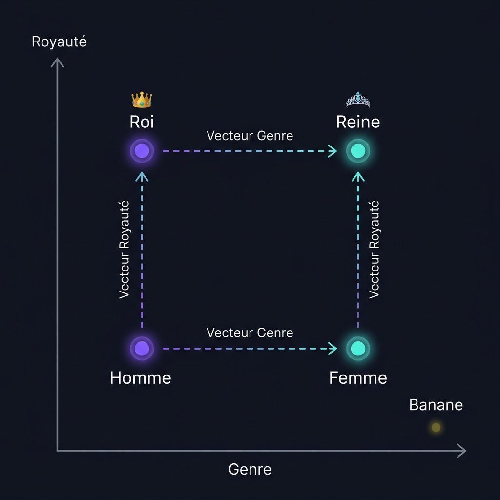
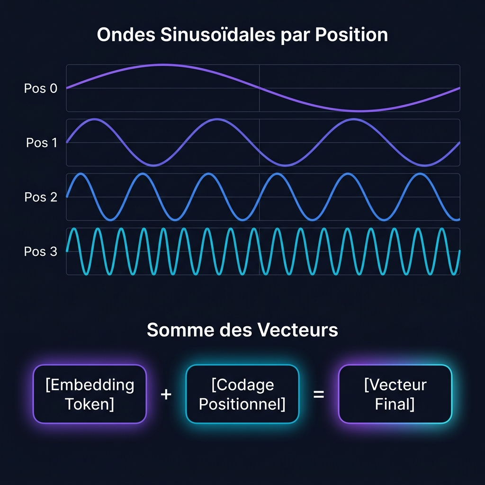
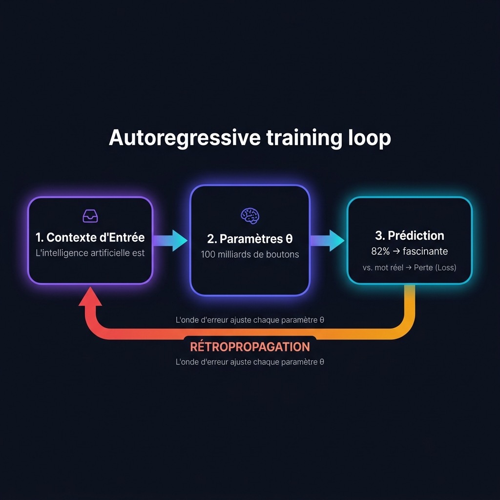

# LA CRÉATION D'UN LLM {.act-section .act-pre background-color="#0D0F1A"}

::: badge-v
Le Pipeline de Fabrication
:::

## Groupe 1 : Pré-entraînement — 1. Tokenisation {auto-animate="true"}

<div style="height: 2.5rem;"></div>

::: {.columns}

::: {.column width="50%"}
### Le Concept Technique
Un texte brut doit être traduit sous forme numérique.
- **Tokens** : Les briques de texte élémentaires générées par l'algorithme **BPE (Byte-Pair Encoding)**.
- **Vocabulaire $\mathcal{V}$** : La collection statique de tous les tokens uniques (typiquement $|\mathcal{V}| \approx 32k - 256k$).

::: formula-box
$$\text{Tokenizer}(S) = [t_1, t_2, \ldots, t_N] \quad \text{où } t_i \in \mathcal{V}$$
:::
:::

::: {.column width="50%"}
### L'Analogie Pédagogique
> C'est l'équivalent de découper un texte en pièces de Lego. Si vous avez une brique pour chaque mot de la langue, votre boîte est immense. Si vous n'avez que des lettres, la construction est trop longue. Les tokens sont les briques intermédiaires idéales, où chaque pièce reçoit un **identifiant numérique (ID)** unique.

::: card-v
**Exemple de découpage :**
`"Comprendre les LLM est fascinant !"`
$\downarrow$
`["Com", "prendre", " les", " LL", "M", " est", " fascin", "ant", " !"]`
$\downarrow$
`[8740, 1243, 104, 298, 1021, 310, 5420, 124, 103]`
:::
:::

:::

## Groupe 1 : Pré-entraînement — Schéma Visuel : Le Flux de Tokenisation {auto-animate="true"}

<div style="height: 2.5rem;"></div>

::: {.arch-flow}

::: {.arch-node}
<h4>📝 1. Texte Brut</h4>
`"Comprendre les LLM..."`
:::

::: {.arch-arrow}
➔
:::

::: {.arch-node .core}
<h4>✂️ 2. Tokenizer BPE</h4>
`["Com", "prendre", " les", " LL", "M"]`
:::

::: {.arch-arrow}
➔
:::

::: {.arch-node}
<h4>🔢 3. Identifiants (IDs)</h4>
`[8740, 1243, 104, 298, 1021]`
:::

:::

<div style="height: 2.5rem;"></div>

::: highlight-band
**Éclairage Pédagogique** : Le modèle ne voit jamais de lettres humaines. Il voit une suite continue d'identifiants mathématiques uniques servant de clés d'entrée dans son vocabulaire.
:::

## Groupe 1 : Pré-entraînement — 2. Embeddings & Espace {auto-animate="true"}

<div style="height: 2.5rem;"></div>

::: {.columns}

::: {.column width="50%"}
### Le Concept Technique
Pour donner du sens aux nombres, nous projetons chaque token sous forme de **vecteur** dans un espace continu de haute dimension :

::: formula-box
$$\vec{e}_i = \mathbf{E}[t_i] \in \mathbb{R}^{d_{\text{model}}} \quad \text{où } d_{\text{model}} \approx 4096$$
:::

Nous mesurons la proximité sémantique à l'aide de la **similarité cosinus** :
$$\cos(\theta) = \frac{\vec{A} \cdot \vec{B}}{\|\vec{A}\| \|\vec{B}\|}$$
:::

::: {.column width="50%"}
### L'Analogie Pédagogique
> Comment expliquer la notion de "genre" ou de "royauté" à une machine ? On place les mots sur une carte géographique géante à plusieurs dimensions. Les mots proches en sens s'y retrouvent physiquement voisins.

::: card-v
**La géométrie du sens :**
$$\vec{v}_{\text{Roi}} - \vec{v}_{\text{Homme}} \approx \vec{v}_{\text{Reine}} - \vec{v}_{\text{Femme}}$$

En se déplaçant dans une direction précise (ajouter le vecteur "genre"), on transforme les coordonnées géographiques de **Roi** en celles de **Reine**.
:::
:::

:::

## Groupe 1 : Pré-entraînement — Schéma Visuel : La Carte Vectorielle {auto-animate="true"}

<div style="height: 2rem;"></div>

::: {.columns}

::: {.column width="58%"}
<div style="background: rgba(255,255,255,0.02); border: 1px solid rgba(255,255,255,0.08); border-radius: 14px; padding: 1rem; text-align: center;">
<p style="font-family: 'Outfit', sans-serif; font-size: 1.1rem; font-weight: 600; color: #A5B4FC; margin-bottom: 0.8rem; letter-spacing: 0.03em;">Espace Vectoriel Multi-Dimensionnel — $\mathbb{R}^{d_{\text{model}}}$</p>

{width="100%"}

</div>
:::

::: {.column width="42%"}
<div style="height: 0.5rem;"></div>

::: card-v
**La Géométrie du Sens**

Les mots sont placés sur une carte à $d_{\text{model}}$ dimensions. Leur **position** encode leur **signification**.
:::

<div style="height: 0.6rem;"></div>

::: highlight-band
**Parallélisme vectoriel** — Le décalage de *Homme* → *Femme* est géométriquement parallèle à *Roi* → *Reine*. C'est l'arithmétique du sens.
:::

<div style="height: 0.6rem;"></div>

::: card-g
**Isolation sémantique** — Les concepts sans rapport (*Banane*) sont repoussés dans des régions distantes de l'espace, confirmant que la proximité = similarité.
:::
:::

:::

## Groupe 1 : Pré-entraînement — 3. Codage Positionnel {auto-animate="true"}

<div style="height: 2.5rem;"></div>

::: {.columns}

::: {.column width="50%"}
### Le Concept Technique
Les Transformers traitent tous les mots en même temps (**invariance par permutation**). Pour retenir l'ordre de la phrase, nous ajoutons une onde trigonométrique unique à l'embedding du mot :

::: formula-box
$$PE_{(pos, 2i)} = \sin\left(\frac{pos}{10000^{2i/d_{\text{model}}}}\right)$$
$$PE_{(pos, 2i+1)} = \cos\left(\frac{pos}{10000^{2i/d_{\text{model}}}}\right)$$
$$\vec{x}_{\text{final}} = \vec{e}_{\text{token}} + \vec{PE}_{\text{position}}$$
:::
:::

::: {.column width="50%"}
### L'Analogie Pédagogique
> Si vous mettez une phrase dans un mixeur, vous perdez l'ordre des mots. Pour éviter cela, on applique une signature ondulatoire (sinus/cosinus) aux coordonnées de chaque mot. Cette empreinte permet au modèle de connaître sa position exacte dans la phrase.
:::

:::

## Groupe 1 : Pré-entraînement — Schéma Visuel : Superposition d'Ondes {auto-animate="true"}

<div style="height: 2rem;"></div>

::: {.columns}

::: {.column width="58%"}
<div style="background: rgba(255,255,255,0.02); border: 1px solid rgba(255,255,255,0.08); border-radius: 14px; padding: 1rem; text-align: center;">
<p style="font-family: 'Outfit', sans-serif; font-size: 1.1rem; font-weight: 600; color: #A5B4FC; margin-bottom: 0.8rem; letter-spacing: 0.03em;">Ondes Sinusoïdales & Somme Positionnelle</p>

{width="100%"}

</div>
:::

::: {.column width="42%"}
<div style="height: 0.5rem;"></div>

::: card-v
**Somme des Vecteurs**

- **Entrée** : Embedding $\vec{e}_{\text{token}}$
- **+ Ajout** : Codage Positionnel $\vec{PE}_{\text{pos}}$
- **= Résultat** : Vecteur modulé $\vec{x}_{\text{final}}$
:::

<div style="height: 0.6rem;"></div>

::: highlight-band
**Chaque position reçoit une onde unique** — Les fréquences sin/cos varient par dimension, créant une empreinte irrépétable pour chaque index de la séquence.
:::

<div style="height: 0.6rem;"></div>

::: card-c
**Pourquoi des ondes ?** — Les fonctions trigonométriques permettent au modèle de déduire les distances relatives entre tokens, même sur des séquences jamais vues.
:::
:::

:::

## Groupe 1 : Pré-entraînement — 4. L'Auto-Attention {auto-animate="true"}

<div style="height: 2.5rem;"></div>

::: {.columns}

::: {.column width="50%"}
### Le Concept Technique
Les tokens ajustent dynamiquement leur représentation en fonction du contexte global de la phrase grâce au mécanisme d'attention :

::: formula-box
$$\text{Attention}(Q, K, V) = \text{softmax}\left(\frac{QK^T}{\sqrt{d_k}}\right)V$$
:::

- **Requêtes ($Q$)** : Ce qu'un mot cherche.
- **Clés ($K$)** : Ce que les autres mots offrent.
- **Valeurs ($V$)** : Le contenu extrait après mise en relation.
:::

::: {.column width="50%"}
### L'Analogie Pédagogique
> Prenez le mot **"vol"**. Dans *"le vol a été retardé"*, votre cerveau surligne *"retardé"* pour comprendre qu'il s'agit d'un avion.
> Avec l'Auto-Attention, chaque token agit comme une **Requête** interrogeant tous les autres mots (**Clés**). Lorsqu'il trouve une relation sémantique, il fusionne sa **Valeur** pour s'ajuster.

::: highlight-band
**Adaptation sémantique :**
- Vol $\dots$ Retardé = Avion (Transport)
- Vol $\dots$ Banque = Cambriolage (Crime)
:::
:::

:::

## Groupe 1 : Pré-entraînement — Schéma Visuel : La Matrice d'Attention {auto-animate="true"}

<div style="height: 2.5rem;"></div>

::: {.columns}

::: {.column width="50%"}
### Matrice de corrélation : "vol de l'avion"
| Token | vol | de | l | avion |
|---|---|---|---|---|
| **vol** | 0.15 | 0.02 | 0.01 | **0.82** |
| **de** | 0.05 | 0.85 | 0.05 | 0.05 |
| **l** | 0.02 | 0.03 | 0.90 | 0.05 |
| **avion** | **0.78** | 0.02 | 0.01 | 0.19 |
:::

::: {.column width="50%"}
::: card-v
**Décryptage des scores :**
- Le mot **vol** lie son attention à **avion** avec un score de `0.82`.
- Ce calcul modifie dynamiquement la coordonnée de *vol* vers le concept de *transport* lors du traitement de la phrase.
- L'attention multi-têtes effectue ce calcul en parallèle sur $h$ filtres contextuels.
:::
:::

:::

## Groupe 1 : Pré-entraînement — 5. Boucle d'Entraînement {auto-animate="true"}

<div style="height: 2.5rem;"></div>

::: {.columns}

::: {.column width="50%"}
### Le Concept Technique
Le modèle apprend à maximiser la probabilité du token suivant de manière autorégressive.
- **Perte (Cross-Entropy)** : Mesure l'erreur de prédiction.
- **Rétropropagation & Descente de Gradient** :
$$\theta \leftarrow \theta - \eta \nabla \mathcal{L}$$
:::

::: {.column width="50%"}
### L'Analogie Pédagogique
> Imaginez un instrument de musique doté de 100 milliards de boutons. Le modèle joue à un jeu de **"Devine le prochain mot"** des milliers de milliards de fois.
> S'il se trompe, un chef d'orchestre calcule l'erreur (**Perte**) et renvoie une onde correctrice en arrière (**Rétropropagation**) pour tourner chaque bouton d'une fraction de millimètre.
:::

:::

## Groupe 1 : Pré-entraînement — Schéma Visuel : Boucle Autorégressive {auto-animate="true"}

<div style="height: 2rem;"></div>

::: {.columns}

::: {.column width="58%"}
<div style="background: rgba(255,255,255,0.02); border: 1px solid rgba(255,255,255,0.08); border-radius: 14px; padding: 1rem; text-align: center;">
<p style="font-family: 'Outfit', sans-serif; font-size: 1.1rem; font-weight: 600; color: #A5B4FC; margin-bottom: 0.8rem; letter-spacing: 0.03em;">Pipeline Prédiction → Perte → Rétropropagation</p>

{width="100%"}

</div>
:::

::: {.column width="42%"}
<div style="height: 0.5rem;"></div>

::: card-v
**Le Cycle d'Apprentissage**

Le modèle prédit le mot suivant, mesure son erreur (**Perte**), puis rétropropage un gradient correcteur à travers ses $100$ milliards de paramètres $\theta$.
:::

<div style="height: 0.6rem;"></div>

::: highlight-band
**Rétropropagation** — L'onde d'erreur remonte du résultat vers chaque couche, ajustant chaque paramètre d'une fraction : $\theta \leftarrow \theta - \eta \nabla \mathcal{L}$
:::

<div style="height: 0.6rem;"></div>

::: card-g
**Répété des billions de fois** — Ce cycle s'exécute sur l'intégralité du corpus Internet, comprimant la connaissance du monde dans les poids du modèle.
:::
:::

:::

## Groupe 2 : Fine-tuning {auto-animate="true" .center}

::: badge-c
La Phase d'Alignement
:::

## Groupe 2 : Fine-tuning — 1. SFT Supervisé {auto-animate="true"}

<div style="height: 2.5rem;"></div>

::: {.columns}

::: {.column width="50%"}
### Le Concept Technique
Le modèle pré-entraîné brut ne sait que compléter du texte. Nous réalisons un **Fine-tuning Supervisé (SFT)** en utilisant des paires de consignes et de réponses attendues :

::: formula-box
$$\mathcal{L}_{\text{SFT}} = -\sum_{t \in \text{réponse}} \log P_\theta(w_t \mid w_{<t})$$
:::

Cela réoriente la distribution de probabilité du modèle pour qu'il réponde aux instructions.
:::

::: {.column width="50%"}
### L'Analogie Pédagogique
> Notre apprenti érudit connaît tous les livres du monde, mais si vous lui posez une question, il peut se mettre à réciter un poème au hasard.
> Le Fine-tuning consiste à l'envoyer dans une **"école d'assistants"** pour lui apprendre le format du dialogue : quand on pose une question, il doit y répondre directement et poliment.

::: card-c
**Avant SFT** : *"Explique la gravité."* $\rightarrow$ *"...La gravité a été conceptualisée par Newton en 1687 lorsqu'une pomme est tombée de..."*
**Après SFT** : *"Explique la gravité."* $\rightarrow$ *"La gravité est une force naturelle d'attraction entre deux masses..."*
:::
:::

:::

## Groupe 2 : Fine-tuning — Schéma Visuel : Entonnoir de Distribution {auto-animate="true"}

<div style="height: 2.5rem;"></div>

::: {.columns}

::: {.column width="50%"}
::: {.formula-box}
**Modèle Pré-entraîné (Complétion Libre)**
```
Prompt: "J'ai adoré votre outil..."
  ├── "donc j'écris cet avis." [45%]
  ├── "et voici d'autres avis." [35%]
  └── "mais la livraison fut lente." [20%]
```
:::
:::

::: {.column width="50%"}
::: {.formula-box}
**Modèle SFT Alignement (Consignes)**
```
Prompt: "Réécris cet avis de manière positive."
  ├── "Excellent outil ! Je recommande vivement." [92%]
  ├── "Complétion générique..." [6%]
  └── "Autre..." [2%]
```
:::
:::

:::

<div style="height: 1rem;"></div>

::: highlight-band
**Canalisation SFT** : Le prompt structure et restreint les chemins de sortie du modèle pour cibler un comportement d'assistant précis.
:::

## Groupe 2 : Fine-tuning — 2. Ajuster les Poids {auto-animate="true"}

<div style="height: 2.5rem;"></div>

::: {.columns}

::: {.column width="50%"}
### Le Concept Technique
Nous ajustons les poids pré-entraînés $W_0$ sans détruire la base de connaissances (pour éviter **l'Oubli Catastrophique**).
- **Taux d'Apprentissage Microscopique ($\eta$)** : Applique de minuscules corrections.
- **PEFT / LoRA (Low-Rank Adaptation)** : On gèle les poids de base $W_0$ et on entraîne uniquement des matrices de bas rang :
$$W = W_0 + B \times A$$
:::

::: {.column width="50%"}
### L'Analogie Pédagogique
> Pour qu'un pianiste classique apprenne le jazz, on ne lui efface pas la mémoire pour tout recommencer. On ajuste délicatement son rythme et ses enchaînements d'accords.
> Avec un taux d'apprentissage minuscule ou des **adaptateurs (LoRA)**, on applique des corrections chirurgicales en gardant sa culture intacte.
:::

:::

## Groupe 3 : RLHF {auto-animate="true"}

::: badge-g
Apprentissage par Renforcement
:::

## Groupe 3 : RLHF — 1. Modèle de Récompense {auto-animate="true"}

<div style="height: 2.5rem;"></div>

::: {.columns}

::: {.column width="50%"}
### Le Concept Technique
Le goût humain est subjectif, impossible d'en faire une équation magique. On entraîne un **Modèle de Récompense (RM)** $r_\psi(x, y)$ qui renvoie un score scalaire de qualité, en s'appuyant sur des comparaisons par paires ($y_w \succ y_l$) :

::: formula-box
$$\mathcal{L}_{\text{RM}} = -\mathbb{E}_{(x, y_w, y_l)} \left[ \log \sigma\left(r_\psi(x, y_w) - r_\psi(x, y_l)\right) \right]$$
:::
:::

::: {.column width="50%"}
### L'Analogie Pédagogique
> Le goût humain est subjectif, impossible d'en faire une équation magique.
> En revanche, si on montre deux réponses à un humain, il sait facilement dire laquelle est la meilleure.
> En analysant ces duels, on entraîne un **juge numérique** à attribuer une note de $-3,0$ (mauvais/dangereux) à $+3,0$ (excellent/sûr) à chaque réponse.
:::

:::

## Groupe 3 : RLHF — Schéma Visuel : Duel de Préférences {auto-animate="true"}

<div style="height: 2.5rem;"></div>

::: {.grid-3}

::: {.card}
<h4>📝 Prompt</h4>
`"Explique l'IA simplement."`
:::

::: {.card}
<h4>🆚 Choix du Duel</h4>
- **Réponse A** : *"L'IA est un réseau neuronal..."*
- **Réponse B** : *"L'IA est comme un cerveau..."*
:::

::: {.card-g}
<h4>⚖️ Évaluation du Juge</h4>
- L'humain préfère : **Réponse B**
- Score du Juge (A) : `-1.42` (Moyen)
- Score du Juge (B) : `+2.65` (Excellent)
:::

:::

<div style="height: 1.5rem;"></div>

::: highlight-band
**Mathématique de Préférence Bradley-Terry** : L'écart entre les scores dicte l'ajustement. Le réseau de neurones apprend à modéliser mathématiquement les goûts humains.
:::

## Groupe 3 : RLHF — 2. PPO & Alignement {auto-animate="true"}

<div style="height: 2.5rem;"></div>

::: {.columns}

::: {.column width="50%"}
### Le Concept Technique
Nous optimisons la politique du modèle $\pi_\theta$ avec l'algorithme **PPO (Proximal Policy Optimization)** pour maximiser le score du juge numérique, tout en ajoutant une **pénalité de divergence KL** pour empêcher le modèle de trop s'éloigner du modèle SFT initial :

::: formula-box
$$\text{Objectif}(\theta) = \mathbb{E} \left[ r_\psi(x, y) - \beta D_{\text{KL}}(\pi_\theta(y \mid x) \,\|\, \pi_{\text{sft}}(y \mid x)) \right]$$
:::
:::

::: {.column width="50%"}
### L'Analogie Pédagogique
> Si vous donnez une friandise à votre chien à chaque fois qu'il s'assoit, il peut faire n'importe quoi juste pour réclamer à manger.
> Sans contraintes, une IA va inventer des mots "tricheurs" qui plaisent au juge numérique mais ne veulent rien dire.
> On lui attache une **laisse mathématique (la divergence KL)** qui la pénalise dès qu'elle s'éloigne de sa façon naturelle de parler.
:::

:::

## Groupe 3 : RLHF — Schéma Visuel : Équilibre des Forces {auto-animate="true"}

<div style="height: 2.5rem;"></div>

::: {.columns}

::: {.column width="50%"}
::: {.formula-box}
**Vecteurs de Forces de la Politique**
```
      ◀─── [Laisse Divergence KL] ─── (Politique Active) ─── [Attraction Juge (RM)] ───►
           (Rester proche du SFT)         [Modèle Core]       (Maximiser l'avis Humain)
```
:::
:::

::: {.column width="50%"}
::: card-g
**Pourquoi cet équilibre est mathématiquement vital :**
- **L'attraction du juge** maximise la pertinence et la sécurité.
- **L'élastique de divergence KL** empêche le modèle de s'effondrer dans du jargon incompréhensible qui plairait statistiquement au juge mais perdrait toute syntaxe.
:::
:::

:::

# ACT I {.act-section .act1 background-color="#0D0F1A"}

::: badge-v
La Couche Intelligence
:::

## Qu'est-ce qu'un LLM ?

::: {.columns}

::: {.column width="55%"}
Un **Large Language Model** est un modèle autorégressif qui apprend la distribution conditionnelle du langage :

::: formula-box
$$P(w_1, \ldots, w_T) = \prod_{t=1}^{T} P(w_t \mid w_1, \ldots, w_{t-1})$$
:::

À chaque pas, le modèle prédit le **token suivant** parmi un vocabulaire $\mathcal{V}$ (30k–100k tokens).
:::

::: {.column width="45%"}

::: {.fragment .fade-up}
::: card-v
**Lois de scaling**

- Paramètres : 7B → 1T+
- Données : trillions de tokens
- Compute : milliers de GPU·jours
:::
:::

::: {.fragment .fade-up}
::: card
**Ce que ça change pour vous**

Ce n'est pas un moteur de recherche.
C'est un **générateur de probabilités sur du texte**.
:::
:::

:::

:::

## Comment il apprend

::: {.columns}

::: {.column width="50%"}
**Pré-entraînement** — maximiser la log-vraisemblance :

::: formula-box
$$\mathcal{L} = -\sum_{t=1}^{T} \log P_\theta(w_t \mid w_{<t})$$
:::

Optimisé par **AdamW** + scheduler cosine.

::: {.fragment .fade-up}
::: highlight-band
**Loi de Chinchilla** : pour $N$ paramètres, il faut $\approx 20N$ tokens d'entraînement optimal.
:::
:::

:::

::: {.column width="50%"}

::: {.fragment .fade-up}
**Pipeline complet**

**① Pré-entraînement** — corpus massif, prédiction de token

**② SFT** — fine-tuning supervisé sur des démonstrations

**③ RLHF** — alignement par feedback humain
:::

:::

:::

## Le Transformer : Self-Attention

::: {.columns}

::: {.column width="55%"}
Le mécanisme central — chaque token **attend** tous les autres :

::: formula-box
$$\text{Attention}(Q,K,V) = \text{softmax}\!\left(\frac{QK^\top}{\sqrt{d_k}}\right)\!V$$
:::

- $Q$ = ce que je cherche, $K$ = ce que j'offre, $V$ = ce que je transmets
- $\sqrt{d_k}$ : normalisation pour éviter la saturation du softmax

::: {.fragment .fade-up}
**Multi-head** : $h$ têtes parallèles, chacune capture une relation différente.
:::

:::

::: {.column width="45%"}

::: {.fragment .zoom-in}
::: card-v
**Intuition contextuelle**

Le mot *"avocat"* dans *"manger un avocat"* vs *"appeler son avocat"* reçoit des représentations **différentes** grâce à l'attention.
:::
:::

:::

:::

## Tokens & Échantillonnage

::: {.columns}

::: {.column width="50%"}
**Tokenisation BPE / SentencePiece**

`"Product Manager"` → `["Product", " Man", "ager"]`

**Distribution de sortie** avec température $T$ :

::: formula-box
$$P(w_i) = \frac{\exp(z_i / T)}{\sum_j \exp(z_j / T)}$$
:::

- $T \to 0$ : déterministe (greedy)
- $T = 1$ : distribution apprise
- $T > 1$ : plus créatif, moins précis
:::

::: {.column width="50%"}

::: {.fragment .fade-up}
**Stratégies d'échantillonnage**

| Méthode | Principe |
|---|---|
| Greedy | $\arg\max$ à chaque pas |
| Top-k | Filtrer les $k$ meilleurs |
| Top-p (nucleus) | Masse cumulée $p$ |
| Beam search | $b$ séquences en parallèle |

:::

:::

:::

## RLHF : Aligner le modèle

::: {.columns}

::: {.column width="55%"}
**Reinforcement Learning from Human Feedback**

**① Reward Model** entraîné sur préférences humaines : $r_\phi(x,y)$

**② PPO** optimise la politique $\pi_\theta$ contre ce reward :

::: formula-box
$$\max_{\pi_\theta}\ \mathbb{E}[r_\phi(x,y)] - \beta\, D_{\text{KL}}[\pi_\theta \| \pi_{\text{ref}}]$$
:::

Le terme KL évite que le modèle s'éloigne trop du modèle de référence.
:::

::: {.column width="45%"}

::: {.fragment .fade-up}
::: card-c
**Variantes modernes**

- **DPO** — Direct Preference Optimization (sans RM explicite)
- **RLAIF** — feedback généré par un autre LLM
- **Constitutional AI** — règles de constitution (Anthropic)
:::
:::

:::

:::

## Le Prompt comme Interface

::: {.columns}

::: {.column width="50%"}
**Structure d'un prompt efficace**

::: card-v
```
RÔLE       Tu es un analyste produit senior
CONTEXTE   Feedbacks de la semaine : [...]
TÂCHE      Identifie les 3 pain points prioritaires
FORMAT     JSON avec score d'impact
CONTRAINTE Max 200 tokens, pas d'hallucination
```
:::

::: {.fragment .fade-up}
**Chain-of-Thought** : ajouter *"Raisonne étape par étape"* améliore les performances de ~30% sur les tâches complexes.
:::

:::

::: {.column width="50%"}

::: {.fragment .fade-up}
**Ce qu'un LLM bien prompté peut faire**

- ✍️ Rédiger, reformuler, traduire
- 📊 Extraire, classifier, structurer
- 🔍 Résumer, analyser, comparer
- 💡 Brainstormer, générer des variantes
- 🧮 Raisonner pas à pas sur des données
:::

:::

:::

## Limites critiques du LLM

::: {.columns}

::: {.column width="50%"}
::: card-v
**❌ Pas de mémoire persistante**

La fenêtre de contexte est finie (8k–128k tokens). Au-delà, le modèle oublie.
:::

::: {.fragment .fade-up}
::: card
**❌ Hallucinations**

Le modèle génère du texte plausible, pas nécessairement exact. Perplexité basse ≠ exactitude factuelle.
:::
:::

::: {.fragment .fade-up}
::: card
**❌ Pas d'action dans le monde**

Un LLM seul ne peut pas envoyer un email, modifier un ticket ni appeler une API.
:::
:::

:::

::: {.column width="50%"}

::: {.fragment .zoom-in}
::: highlight-band
**La conclusion de l'ACT I**

Un LLM est un cerveau extraordinairement cultivé.
Mais **sans mains, sans mémoire, sans agenda**.

C'est là qu'entre l'Agent.
:::
:::

:::

:::

## RAG : Mémoire Externe

::: {.columns}

::: {.column width="55%"}
**Retrieval-Augmented Generation**

**① Encode** — la question $q$ → vecteur $e_q \in \mathbb{R}^d$

**② Retrieve** — similarité cosinus sur une base vectorielle :

::: formula-box
$$\text{sim}(e_q, e_d) = \frac{e_q \cdot e_d}{\|e_q\|\,\|e_d\|}$$
:::

**③ Augment** — injecter les chunks les plus proches dans le prompt

**④ Generate** — le LLM répond en se fondant sur les documents récupérés
:::

::: {.column width="45%"}

::: {.fragment .fade-up}
::: card-g
**Cas d'usage PM**

Interroger 3 ans de feedbacks Intercom en langage naturel, avec **citations de source** et **score de confiance**.
:::
:::

:::

:::

## Checkpoint ACT I {background-color="#0a0014"}

::: checkpoint
### 🧠 Ce qu'est un LLM

Un modèle autorégressif qui génère du texte token par token, entraîné par maximisation de vraisemblance puis aligné par RLHF.

**Il est puissant mais aveugle, astatique et inactif.**

::: {.fragment .fade-up}
| ✅ Ce qu'il fait | ❌ Ce qu'il ne fait pas |
|---|---|
| Génère du texte pertinent | Mémoriser entre les sessions |
| Comprend le contexte | Agir dans le monde réel |
| Suit des instructions | Garantir l'exactitude factuelle |
:::

:::

# ACT II {.act-section .act2 background-color="#020f14"}

::: badge-c
La Couche Agentique
:::

## Du LLM à l'Agent

::: {.columns}

::: {.column width="55%"}
Un **Agent IA** = LLM + 4 composants indispensables

**🧠 Cerveau** — LLM pour le raisonnement et la génération

**💾 Mémoire** — courte (contexte), longue (vector store), épisodique

**🛠️ Outils** — APIs, code sandbox, recherche, base de données

**🔄 Boucle** — plan → action → observation → itération
:::

::: {.column width="45%"}

::: {.fragment .zoom-in}
::: card-c
**La différence clé**

Un LLM **répond**.
Un Agent **agit**.

Il peut exécuter du code, appeler des APIs, lire des fichiers, écrire dans une base de données — et recommencer jusqu'à atteindre son objectif.
:::
:::

:::

:::

## L'Anatomie d'un Agent

::: agent-diagram
::: ad-lines
::: ad-line-h
:::
::: ad-line-v
:::
:::

::: {.ad-node .ad-top .fragment .fade-up}
<h4>🧠 Cerveau</h4>
<p>LLM (Raisonnement, Planification)</p>
:::

::: {.ad-node .ad-left .fragment .slide-right}
<h4>💾 Mémoire</h4>
<p>Contexte court, RAG long terme</p>
:::

::: {.ad-center .fragment .zoom-in}
<h3 class="grad-v">AGENT</h3>
<p style="font-size: 1.2rem; margin-top: 0.5rem; color: #fff;">Orchestrateur</p>
:::

::: {.ad-node .ad-right .fragment .slide-left}
<h4>🛠️ Outils</h4>
<p>Recherche Web, APIs, Python</p>
:::

::: {.ad-node .ad-bottom .fragment .fade-up}
<h4>⚙️ Action</h4>
<p>Exécution dans le monde réel</p>
:::
:::

## La Boucle ReAct

::: {.columns}

::: {.column width="55%"}
**Reason + Act** — le pattern fondamental

**① Thought** — raisonnement interne sur l'état actuel

**② Action** — appel d'outil (`search`, `code`, `write`)

**③ Observation** — résultat retourné par l'outil

**④ Repeat** — jusqu'à l'objectif atteint ou échec

::: {.fragment .fade-up}
::: highlight-band
Formellement : $\pi(a_t \mid s_t, h_{<t})$ où $h$ est l'historique des (thought, action, obs).
:::
:::

:::

::: {.column width="45%"}

::: {.fragment .fade-up}
```python
# Pseudocode ReAct
while not done:
    thought = llm.reason(state, history)
    action  = llm.choose_tool(thought)
    obs     = tools[action].run()
    history.append((thought, action, obs))
    done    = llm.is_complete(obs)
```
:::

:::

:::

## Mémoire & Outils

::: {.columns}

::: {.column width="50%"}
**Types de mémoire**

| Type | Durée | Mécanisme |
|---|---|---|
| Contexte | Session | Fenêtre de tokens |
| Vectorielle | Long terme | Embeddings + ANN |
| Épisodique | Historique | Résumés structurés |
| Procédurale | Permanent | Prompt système |

:::

::: {.column width="50%"}

::: {.fragment .fade-up}
**Outils typiques**

- 🔍 **Recherche** — Web, Confluence, Slack
- 💻 **Code** — Python sandbox, SQL, R
- 📝 **Écriture** — GitLab, Notion, email, Slack
- 📊 **Analyse** — CSV, BI dashboards, métriques
- 🌐 **APIs** — REST, GraphQL, webhooks
:::

:::

:::

## Plan & Execute

::: {.columns}

::: {.column width="55%"}
Pour les tâches complexes : **décomposer avant d'agir**

**① Planner** — LLM décompose l'objectif en sous-tâches $\{t_1, \ldots, t_n\}$

**② Executor** — agent exécute chaque $t_i$ avec ses outils

**③ Replanner** — révise le plan si une étape échoue

::: {.fragment .fade-up}
::: highlight-band
Avantage : le Planner raisonne en **langage naturel** ; l'Executor opère en **mode outillé**. Séparation des responsabilités.
:::
:::

:::

::: {.column width="45%"}

::: {.fragment .zoom-in}
::: card-c
**Exemple PM**

*"Prépare le bilan sprint"*

1. Récupérer tickets fermés (GitLab API)
2. Calculer vélocité (Python)
3. Identifier les blockers (NLP)
4. Rédiger le résumé (LLM)
5. Envoyer sur Slack (webhook)
:::
:::

:::

:::

## Systèmes Multi-Agents

::: {.columns}

::: {.column width="55%"}
**Quand un agent ne suffit pas**

::: card-c
**Orchestrateur** → coordonne et délègue aux agents spécialisés.
:::

::: {.fragment .fade-up}
**Patterns d'orchestration**

| Pattern | Quand l'utiliser |
|---|---|
| Séquentiel | Pipeline ordonné |
| Parallèle | Tâches indépendantes |
| Hiérarchique | Complexité croissante |
| Peer-to-peer | Debate / validation croisée |
:::

:::

::: {.column width="45%"}

::: {.fragment .fade-up}
::: card
**✅ Avantages**

- Spécialisation → meilleure performance
- Isolation des erreurs
- Parallélisme → rapidité
:::
:::

::: {.fragment .fade-up}
::: card
**⚠️ Risques**

- Coûts multipliés
- Erreurs en cascade
- Complexité de débogage
:::
:::

:::

:::

## Human-in-the-Loop & Risques

::: {.columns}

::: {.column width="50%"}
**HITL : quand demander validation ?**

**⚠️ Action irréversible** — suppression, envoi d'email

**💰 Coût élevé** — appel API payant, calcul long

**🎯 Ambiguïté** — objectif mal défini ou contradictoire

**🛡️ Criticité métier** — engagement contractuel, OKR

:::

::: {.column width="50%"}

::: {.fragment .fade-up}
**Les 6 axes de décision**

| Axe | Question clé |
|---|---|
| 🔁 Réversibilité | Peut-on annuler ? |
| ⚡ Complexité | Combien d'étapes ? |
| 🛡️ Risque | Impact si erreur ? |
| 🤖 Autonomie | Niveau de confiance ? |
| 💸 Coût | Budget tokens/API ? |
| 💎 Valeur | ROI attendu ? |
:::

:::

:::

## Checkpoint ACT II {background-color="#020f14"}

::: checkpoint
### 🤖 L'Agent IA en résumé

LLM + Mémoire + Outils + Boucle de raisonnement = un système capable d'**agir de façon autonome** vers un objectif.

::: {.fragment .fade-up}
**La question n'est plus "est-ce possible ?"**

**Elle est : combien d'agents, avec quels outils, sous quelle gouvernance ?**
:::

:::

# ACT III {.act-section .act3 background-color="#001a0f"}

::: badge-g
Agents & Product Boards
:::

## Votre Board, Votre Agent

::: {.columns}

::: {.column width="55%"}
**Ce qu'un Agent PM peut orchestrer**

**📥 Ingestion** — feedbacks, emails, reviews App Store, NPS

**🎫 Tickets** — création, déduplication, priorisation automatique

**🗺️ Roadmap** — scoring RICE/ICE, dépendances, alertes de dérive

**📊 Reporting** — bilan sprint, changelog, suivi OKRs

**🔔 Proactivité** — anomalies détectées, recommandations, blockers

:::

::: {.column width="45%"}

::: {.fragment .zoom-in}
::: card-g
**La promesse**

Moins de tâches répétitives à faible valeur.
Plus de temps pour la **stratégie, l'utilisateur, la décision**.
:::
:::

:::

:::

## Architecture Multi-Agents PM

::: {.columns}

::: {.column width="55%"}
**Combien d'agents ? Le dilemme**

::: highlight-band
**1 agent généraliste** — simple, moins cher, plus facile à déboguer. Suffisant pour ~80% des cas.
:::

::: {.fragment .fade-up}
::: highlight-band
**N agents spécialisés** — meilleure performance, parallélisme, isolation des erreurs. Nécessaire si les tâches sont hétérogènes ou critiques.
:::
:::

::: {.fragment .fade-up}
| Critère | 1 Agent | N Agents |
|---|---|---|
| Volume de tâches | Faible | Élevé |
| Domaines couverts | Homogène | Hétérogène |
| Criticité | Standard | Haute |
| Budget | Limité | Flexible |
:::

:::

::: {.column width="45%"}

::: {.fragment .fade-up}
::: card-g
**Architecture recommandée**

**Orchestrateur PM**

↓ délègue à :

- Agent Feedback (NLP/clustering)
- Agent Backlog (GitLab)
- Agent Reporting (analytics)
- Agent Communication (Slack)

Chaque agent peut être un LLM différent, calibré pour son domaine.
:::
:::

:::

:::

## Workflow : De l'Idée au Ticket

**① Collect** — Agent Feedback scrape Intercom, reviews, NPS, interviews

**② Cluster** — NLP : regroupement thématique, extraction de pain points, scoring fréquence × impact

**③ Draft** — Agent Backlog génère un ticket structuré (titre, description, critères d'acceptance, labels, score RICE)

**④ Review** — Human-in-the-loop : le PM valide, enrichit ou rejette

**⑤ Sync** — Ticket poussé dans GitLab, notif Slack, roadmap mise à jour

::: {.fragment .fade-up}
::: highlight-band
Ce workflow réduit le temps de triage de **~3h/semaine à ~20 min** dans les équipes pionnières.
:::
:::

## Limites & Gouvernance

::: {.columns}

::: {.column width="50%"}
**Ce que l'agent NE doit PAS décider seul**

- ❌ Prioriser un epic stratégique sans validation
- ❌ Communiquer avec un client externe
- ❌ Clore un ticket lié à un engagement contractuel
- ❌ Modifier un OKR ou une métrique nord
- ❌ Recruiter ou évaluer un membre de l'équipe

:::

::: {.column width="50%"}

::: {.fragment .fade-up}
::: card-g
**Le PM comme gouverneur**

Votre rôle évolue :

- De **faire** → à **superviser**
- De **gérer le backlog** → à **définir les règles de l'agent**
- De **écrire des tickets** → à **valider et corriger**

L'agent amplifie votre jugement. Il ne le remplace pas.
:::
:::

:::

:::

## L'Enjeu Multi-Boards

::: {.columns}

::: {.column width="50%"}
**Pourquoi consolider la vue ?**

La réalité d'un PM n'est pas un board unique, mais un **écosystème de boards**.

- **Priorités croisées** : un ticket "Frontend" dépend d'un ticket "API".
- **Goulots d'étranglement** : la QA est saturée sur le Mobile, bloquant la release.
- **Risques invisibles** : une dette technique ignorée sur la Gestion CV retarde les mobilités.
:::

::: {.column width="50%"}

::: {.fragment .fade-up}
::: card-g
**Le défi du PM**
Obtenir une vue globale de l'avancement, des risques et des dépendances **sans passer 3h par jour** à lire des tickets GitLab sur 4 projets différents.
:::
:::

::: {.fragment .fade-up}
::: highlight-band
C'est ici qu'intervient l'Agent : il **lit, synthétise et alerte** en temps réel sur l'ensemble de l'instance GitLab.
:::
:::

:::

:::

## Board 1 : Gestion des CV

::: kanban-board

::: kanban-col
<div class="kanban-col-header">To Do <span class="kanban-col-count">1</span></div>
::: {.k-card .fragment .fade-up}
<h5>Extract skills using LLM</h5>
<div class="k-tags"><span class="k-lbl lbl-backend">Backend</span><span class="k-lbl lbl-enhancement">Enhancement</span></div>
<div class="k-meta"><span class="k-milestone">🚩 Sprint 14</span><span class="k-assignee">AI</span></div>
:::
:::

::: kanban-col
<div class="kanban-col-header">In Progress <span class="kanban-col-count">1</span></div>
::: {.k-card .fragment .fade-up delay="100"}
<h5>Add dark mode toggle</h5>
<div class="k-tags"><span class="k-lbl lbl-frontend">Frontend</span></div>
<div class="k-meta"><span class="k-milestone">🚩 Sprint 14</span><span class="k-assignee c2">PM</span></div>
:::
:::

::: kanban-col
<div class="kanban-col-header">Review <span class="kanban-col-count">0</span></div>
:::

::: kanban-col
<div class="kanban-col-header">Blocked <span class="kanban-col-count">1</span></div>
::: {.k-card .fragment .fade-up delay="200"}
<h5>Fix PDF parser crash</h5>
<div class="k-tags"><span class="k-lbl lbl-bug">Bug</span><span class="k-lbl lbl-urgent">Urgent</span></div>
<div class="k-meta"><span class="k-milestone">🚩 Hotfix</span><span class="k-assignee c3">Dev</span></div>
:::
:::

::: kanban-col
<div class="kanban-col-header">Done <span class="kanban-col-count">0</span></div>
:::

:::

## Board 2 : Gestion des mobilités

::: kanban-board

::: kanban-col
<div class="kanban-col-header">Backlog <span class="kanban-col-count">1</span></div>
::: {.k-card .fragment .fade-up}
<h5>Improve dashboard loading time</h5>
<div class="k-tags"><span class="k-lbl lbl-perf">Performance</span></div>
<div class="k-meta"><span class="k-milestone">🚩 Q3 Release</span><span class="k-assignee c2">PM</span></div>
:::
:::

::: kanban-col
<div class="kanban-col-header">In Progress <span class="kanban-col-count">1</span></div>
::: {.k-card .fragment .fade-up delay="100"}
<h5>Add mobility matching widget</h5>
<div class="k-tags"><span class="k-lbl lbl-frontend">Frontend</span><span class="k-lbl lbl-enhancement">Enhancement</span></div>
<div class="k-meta"><span class="k-milestone">🚩 Sprint 14</span><span class="k-assignee">AI</span></div>
:::
:::

::: kanban-col
<div class="kanban-col-header">QA <span class="kanban-col-count">0</span></div>
:::

::: kanban-col
<div class="kanban-col-header">Blocked <span class="kanban-col-count">1</span></div>
::: {.k-card .fragment .fade-up delay="200"}
<h5>Broken layout on Safari</h5>
<div class="k-tags"><span class="k-lbl lbl-bug">Bug</span></div>
<div class="k-meta"><span class="k-milestone">🚩 Sprint 14</span><span class="k-assignee c3">Dev</span></div>
:::
:::

::: kanban-col
<div class="kanban-col-header">Done <span class="kanban-col-count">0</span></div>
:::

:::

## Board 3 : Gestion API

::: kanban-board

::: kanban-col
<div class="kanban-col-header">To Do <span class="kanban-col-count">2</span></div>
::: {.k-card .fragment .fade-up}
<h5>Add rate-limiting middleware</h5>
<div class="k-tags"><span class="k-lbl lbl-backend">Backend</span><span class="k-lbl lbl-perf">Perf</span></div>
<div class="k-meta"><span class="k-milestone">🚩 Q3 Release</span><span class="k-assignee">AI</span></div>
:::
::: {.k-card .fragment .fade-up delay="100"}
<h5>Migrate logs to OpenTelemetry</h5>
<div class="k-tags"><span class="k-lbl lbl-infra">Infra</span></div>
<div class="k-meta"><span class="k-milestone">🚩 Tech Debt</span><span class="k-assignee c3">Dev</span></div>
:::
:::

::: kanban-col
<div class="kanban-col-header">In Progress <span class="kanban-col-count">0</span></div>
:::

::: kanban-col
<div class="kanban-col-header">Review <span class="kanban-col-count">0</span></div>
:::

::: kanban-col
<div class="kanban-col-header">Blocked <span class="kanban-col-count">0</span></div>
:::

::: kanban-col
<div class="kanban-col-header">Done <span class="kanban-col-count">1</span></div>
::: {.k-card .fragment .fade-up delay="200"}
<h5>Fix 500 error on POST /auth</h5>
<div class="k-tags"><span class="k-lbl lbl-bug">Bug</span><span class="k-lbl lbl-urgent">Urgent</span></div>
<div class="k-meta"><span class="k-milestone">🚩 Hotfix</span><span class="k-assignee c2">PM</span></div>
:::
:::

:::

## L'Agent au service des Boards

::: {.columns}

::: {.column width="55%"}
L'Agent devient votre **Agile Coach** et **Analyste transversal** :

- **👁️ Lecture croisée** : L'Agent accède aux 3 boards GitLab simultanément via l'API.
- **🚨 Détection d'anomalies** : *"Le ticket 'Extract skills' est en 'To Do' depuis 12 jours, risque de dérive."*
- **🔗 Gestion des dépendances** : *"La 'Gestion des mobilités' est bloquée par l'API Gateway."*
- **💡 Proposition d'actions** : Rédaction automatique de sub-tasks, assignation, ou fermeture de tickets dupliqués.

:::

::: {.column width="45%"}

::: {.fragment .zoom-in}
::: card-g
**Synthèse PM Hebdomadaire**

*"Sur 45 tickets actifs : 3 sont bloqués (dont 1 critique sur l'API), la vélocité Frontend est nominale. Je recommande de re-prioriser le fix PDF parser avant le Sprint Planning."*
:::
:::

:::

:::

## Workflow Multi-Agents : GitLab & PM

::: agent-diagram
::: ad-lines
::: ad-line-h
:::
::: ad-line-v
:::
:::

::: {.ad-node .ad-top .fragment .fade-up}
<h4>🦊 GitLab Boards</h4>
<p>Gestion CV, Mobilités, APIs</p>
:::

::: {.ad-node .ad-left .fragment .slide-right}
<h4>🔍 Analysis</h4>
<p>Lecture API, Détection statuts</p>
:::

::: {.ad-center .fragment .zoom-in}
<h3 class="grad-g">INSIGHTS</h3>
<p style="font-size: 1.2rem; margin-top: 0.5rem; color: #fff;">Agent PM</p>
:::

::: {.ad-node .ad-right .fragment .slide-left}
<h4>💡 Recommandations</h4>
<p>Alertes, Goulots, Priorités</p>
:::

::: {.ad-node .ad-bottom .fragment .fade-up}
<h4>🧑‍💻 PM Actions</h4>
<p>Prise de décision, Stratégie</p>
:::
:::

## L'Agent Agile Coach en Action

::: {.columns}
::: {.column width="100%"}
**Vue consolidée des 3 Boards GitLab (CV, Mobilités, API)**
:::
:::

::: kanban-board
::: {.kb-col .fragment .fade-up}
<h4>📋 To Do</h4>
<div class="kb-card">
  <div class="kb-labels"><span class="lbl-backend">backend</span></div>
  <p class="kb-title">Refactor auth flow</p>
  <div class="kb-meta">Sprint 14 • Board API</div>
</div>
<div class="kb-card">
  <div class="kb-labels"><span class="lbl-frontend">frontend</span></div>
  <p class="kb-title">Update CV parser UI</p>
  <div class="kb-meta">Sprint 14 • Board CV</div>
</div>
:::

::: {.kb-col .fragment .fade-up}
<h4>🔄 In Progress</h4>
<div class="kb-card">
  <div class="kb-labels"><span class="lbl-bug">bug</span> <span class="lbl-urgent">urgent</span></div>
  <p class="kb-title">Fix mobile crash on login</p>
  <div class="kb-meta">Release Q3 • Board API</div>
</div>
:::

::: {.kb-col .fragment .fade-up}
<h4>🚧 Blocked</h4>
<div class="kb-card blocked">
  <div class="kb-labels"><span class="lbl-backend">backend</span></div>
  <p class="kb-title">PDF parser failing</p>
  <div class="kb-meta">Sprint 14 • Board CV</div>
</div>
<div class="kb-card blocked">
  <div class="kb-labels"><span class="lbl-enhancement">enhancement</span></div>
  <p class="kb-title">Mobility matching alg</p>
  <div class="kb-meta">Sprint 14 • Board Mobilités</div>
</div>
:::

::: {.kb-col .fragment .fade-up}
<h4>✅ Done</h4>
<div class="kb-card done">
  <div class="kb-labels"><span class="lbl-frontend">frontend</span></div>
  <p class="kb-title">Setup CI/CD</p>
  <div class="kb-meta">Sprint 13</div>
</div>
:::
:::

::: {.fragment .fade-up style="margin-top: 2rem; text-align: center; color: var(--muted); font-size: 1.1rem;"}
*L'Agent scanne ces boards en temps réel et génère des insights consolidés pour le PM.*
:::

## Synthèse Agentique

::: {.columns}
::: {.column width="100%"}
**Rapport généré par l'Agent PM (ALBERT DINUM)**
:::
:::

::: agent-diagram
::: {.ad-node .ad-top .fragment .fade-up}
<h4>🔍 Insight</h4>
<p>Dépendance inter-équipes détectée.</p>
:::

::: {.ad-node .ad-left .fragment .slide-right}
<h4>⚠️ Risque</h4>
<p>Le blocage du parser CV retarde le matching Mobilité.</p>
:::

::: {.ad-center .fragment .zoom-in}
<h3 class="grad-c">AGENT PM</h3>
<p style="font-size: 1.2rem; margin-top: 0.5rem; color: #fff;">Agile Coach</p>
:::

::: {.ad-node .ad-right .fragment .slide-left}
<h4>💡 Recommandation</h4>
<p>Réassigner 1 dév Backend pour débloquer le parser CV.</p>
:::

::: {.ad-node .ad-bottom .fragment .fade-up}
<h4>🧑‍💻 PM Actions</h4>
<p>Validation, Ajustement du Sprint</p>
:::
:::

::: {.columns style="margin-top: 2rem;"}
::: {.column width="100%"}
::: {.fragment .fade-up}
::: highlight-band
**Ce que cela signifie concrètement :** Le PM n'a plus besoin d'inspecter manuellement 45 tickets chaque matin. L'Agent agit comme un **Copilote de Delivery**, mettant en évidence ce qui requiert réellement l'attention humaine.
:::
:::
:::
:::

## Architecture 1 : LangChain + LangGraph

::: {.columns}
::: {.column width="100%"}
**Orchestration par Machine à États** (Graphes cycliques)
:::
:::

::: arch-flow
::: {.arch-node .fragment .fade-up}
<h4>📥 Input</h4>
<p>GitLab Boards, Issues, Metadata</p>
:::
<div class="arch-arrow fragment fade-up"></div>
::: {.arch-node .fragment .fade-up}
<h4>⚙️ Pre-Processing</h4>
<p>LangChain Document Loaders & Splitters</p>
:::
<div class="arch-arrow fragment fade-up"></div>
::: {.arch-node .core .fragment .zoom-in}
<span class="badge-albert">ALBERT (DINUM)</span>
<p>LangGraph State Machine</p>
:::
<div class="arch-arrow fragment fade-up"></div>
::: {.arch-node .fragment .fade-up}
<h4>🔀 Decision</h4>
<p>Analyse, Priorisation, Détection de risques</p>
:::
<div class="arch-arrow fragment fade-up"></div>
::: {.arch-node .fragment .fade-up}
<h4>📤 Output</h4>
<p>Insights PM & Recommandations</p>
:::
:::

::: {.fragment .fade-up style="margin-top: 2rem; text-align: center; color: var(--muted); font-size: 1.1rem;"}
*LangGraph définit un graphe explicite où chaque nœud est une étape de raisonnement et les arêtes (edges) sont les décisions conditionnelles de l'Agent.*
:::

## Structure Python : LangChain + LangGraph

::: {.columns}
::: {.column width="100%"}
::: {.fragment .fade-up}
::: card-v
```text
agent_system/
│
├── config/
│   ├── settings.py
│   └── llm_config.py   # Configuration ALBERT DINUM
│
├── data/
│   └── gitlab_client.py
│
├── chains/
│   ├── parsing_chain.py
│   ├── analysis_chain.py
│   └── recommendation_chain.py
│
├── graph/
│   ├── nodes/
│   │   ├── ingest_node.py
│   │   ├── analysis_node.py
│   │   ├── risk_detection_node.py
│   │   └── summary_node.py
│   └── graph_definition.py
│
├── tools/
│   ├── gitlab_tools.py
│   └── pm_helpers.py
│
├── agent/
│   ├── agent_controller.py
│   └── agent_state.py
│
└── main.py
```
:::
:::
:::
:::

## Comment ça marche ? (LangGraph)

::: {.columns style="margin-top: 2rem;"}

::: {.column width="60%"}
::: {.fragment .fade-up}
**Le cycle de décision pas à pas :**
:::

::: {.fragment .fade-up}
**1. 📥 Ingestion** : L'Agent lit les tickets sur les boards GitLab.
:::
::: {.fragment .fade-up}
**2. 🔍 Analyse** : Il extrait les statuts, labels et priorités.
:::
::: {.fragment .fade-up}
**3. 🧠 Raisonnement** : **ALBERT (DINUM)** croise ces données pour comprendre le contexte.
:::
::: {.fragment .fade-up}
**4. 🔀 Décision** : LangGraph aiguille vers la bonne action (alerter, créer une sous-tâche).
:::
::: {.fragment .fade-up}
**5. 💡 Recommandation** : Le système génère une synthèse actionnable pour le PM.
:::

:::

::: {.column width="40%"}
::: {.fragment .fade-in}
::: card-v
**Pourquoi cette architecture ?**

Elle garantit que l'Agent suit un **processus logique et contrôlable**. Le PM sait exactement *comment* et *pourquoi* une décision a été prise.
:::
:::
:::

:::

## Architecture 2 : Google ADK

::: {.columns}
::: {.column width="100%"}
**Orchestration Déclarative** (Agent Developer Kit)
:::
:::

::: arch-flow
::: {.arch-node .fragment .fade-up}
<h4>📥 Ingestion</h4>
<p>GitLab Webhooks, Milestones, Labels</p>
:::
<div class="arch-arrow fragment fade-up"></div>
::: {.arch-node .fragment .fade-up}
<h4>🛠️ Components</h4>
<p>Skills (Code/Search), Memory, Routing</p>
:::
<div class="arch-arrow fragment fade-up"></div>
::: {.arch-node .core .adk .fragment .zoom-in}
<span class="badge-albert">ALBERT (DINUM)</span>
<p>Cognitive Core (ADK)</p>
:::
<div class="arch-arrow fragment fade-up"></div>
::: {.arch-node .fragment .fade-up}
<h4>🔄 Orchestration</h4>
<p>Monitoring, Feedback Loops automatiques</p>
:::
<div class="arch-arrow fragment fade-up"></div>
::: {.arch-node .fragment .fade-up}
<h4>🧑‍🏫 Output</h4>
<p>Coaching Agile, Détection de goulots</p>
:::
:::

::: {.fragment .fade-up style="margin-top: 2rem; text-align: center; color: var(--muted); font-size: 1.1rem;"}
*Google ADK se concentre sur une configuration par "Skills" et "Tools" de manière déclarative, déléguant la gestion d'état au moteur cognitif plutôt qu'à un graphe strict.*
:::

## Structure Python : Google ADK

::: {.columns}
::: {.column width="100%"}
::: {.fragment .fade-up}
::: card-c
```text
agent_system_adk/
│
├── config/
│   ├── settings.py
│   └── llm_config.py   # Configuration ALBERT DINUM
│
├── data/
│   └── gitlab_client.py
│
├── adk_components/
│   ├── skills/
│   │   ├── parsing_skill.py
│   │   ├── analysis_skill.py
│   │   └── risk_detection_skill.py
│   ├── tools/
│   │   ├── gitlab_tools.py
│   │   └── pm_helpers.py
│   ├── memory/
│   │   └── agent_memory.py
│   └── routing/
│       └── task_router.py
│
├── agent/
│   ├── adk_agent.py
│   └── agent_controller.py
│
└── main.py
```
:::
:::
:::
:::

## Comment ça marche ? (Google ADK)

::: {.columns style="margin-top: 2rem;"}

::: {.column width="60%"}
::: {.fragment .fade-up}
**L'orchestration par "Compétences" :**
:::

::: {.fragment .fade-up}
**1. 📥 Événement** : Un webhook GitLab signale un ticket bloqué.
:::
::: {.fragment .fade-up}
**2. 🛠️ Choix de l'Outil** : L'Agent sélectionne la "Skill" appropriée.
:::
::: {.fragment .fade-up}
**3. 🧠 Interprétation** : **ALBERT (DINUM)** évalue la criticité du blocage.
:::
::: {.fragment .fade-up}
**4. 🔄 Itération** : Le moteur cognitif (ADK) ajuste son plan si besoin.
:::
::: {.fragment .fade-up}
**5. 🧑‍🏫 Action** : L'Agent notifie le PM avec des solutions de contournement.
:::

:::

::: {.column width="40%"}
::: {.fragment .fade-in}
::: card-c
**L'avantage pour le PM**

Moins de règles strictes à définir ! L'Agent ADK est plus "fluide" et s'adapte dynamiquement aux événements imprévus des boards.
:::
:::
:::

:::

## Conclusion {background-color="#001a0f"}

::: checkpoint
### 🚀 Ce que vous emportez aujourd'hui

::: {.columns}

::: {.column width="33%"}
::: card
**1 · LLMs**

Modèles probabilistes. Puissants, mais sans mémoire ni action.
:::
:::

::: {.column width="33%"}
::: card
**2 · Agents**

LLM + outils + boucle. Ils agissent, itèrent, orchestrent.
:::
:::

::: {.column width="33%"}
::: card
**3 · Product**

L'agent PM existe. La question est : comment le gouverner ?
:::
:::

:::

::: {.fragment .fade-up}
**Prochaine étape** — Identifiez une tâche répétitive dans votre semaine. Demandez-vous : *un agent pourrait-il faire ça avec les bons outils ?*
:::

:::
